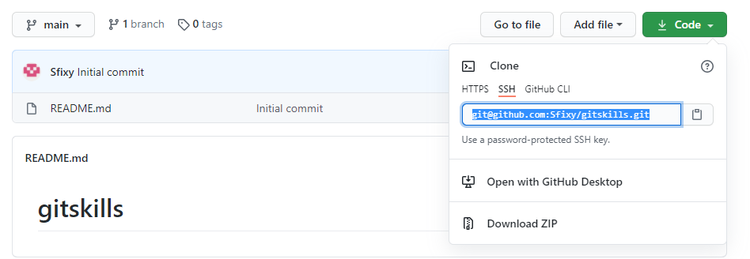
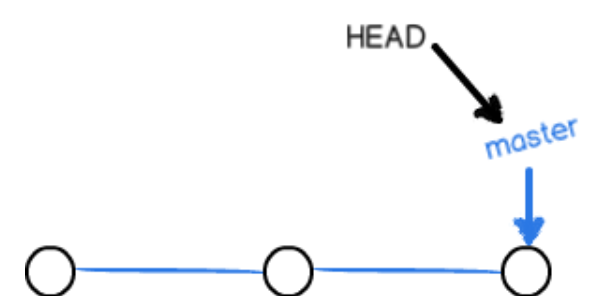
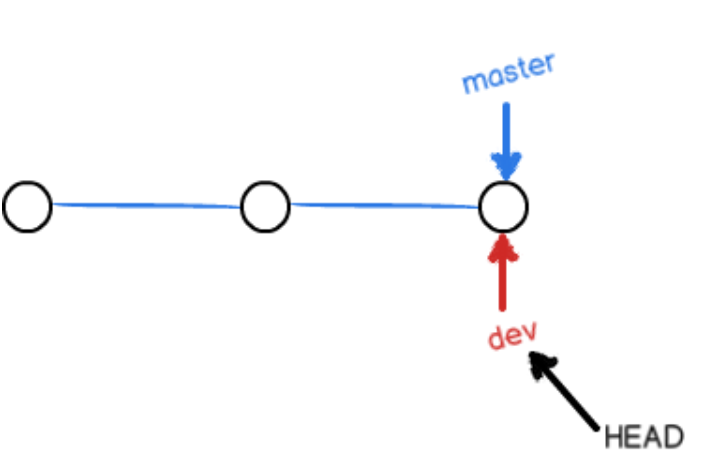
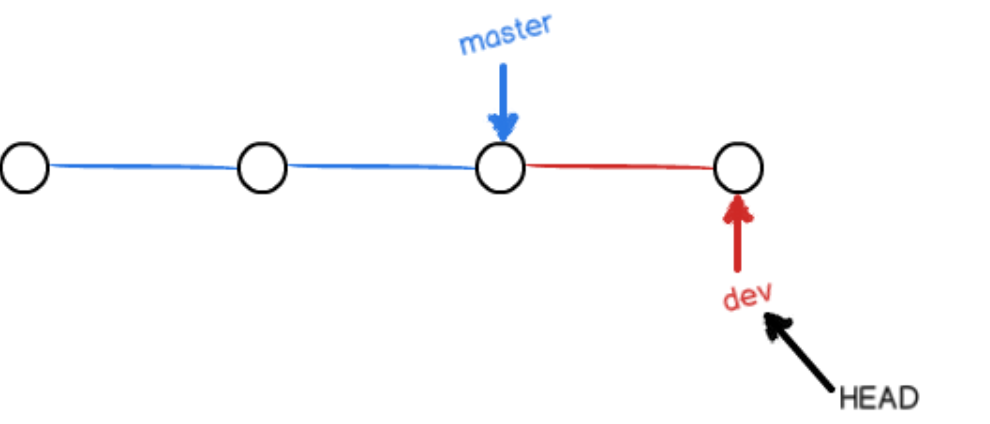
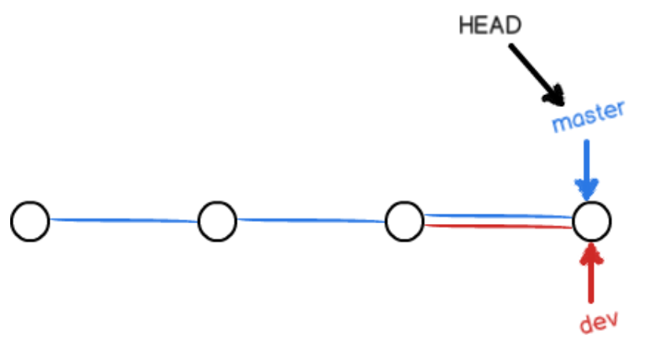
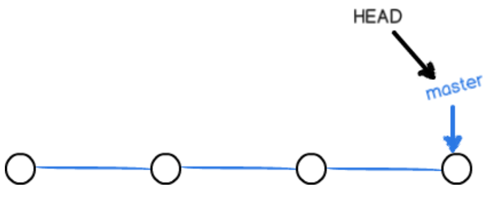
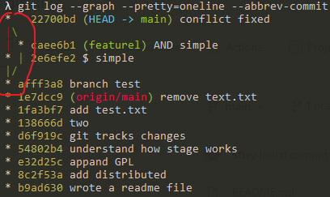
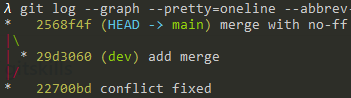

# Git

```git
git init 把本地文件夹变得git可以管理仓库
git add 文件名  把文件加入仓库
git commit -m "对本次提交的描述" 对本次提交修改的描述
```

#### git status

```git
git status  查看仓库状态
On branch master
Changes not staged for commit:
  (use "git add <file>..." to update what will be committed)
  (use "git checkout -- <file>..." to discard changes in working directory)

	modified:   readme.txt

no changes added to commit (use "git add" and/or "git commit -a")
readme.txt文件已经被修改了
```

#### git diff

```git
git diff 文件名
diff --git a/readme.txt b/readme.txt
index 46d49bf..9247db6 100644
--- a/readme.txt
+++ b/readme.txt
@@ -1,2 +1,2 @@
-Git is a version control system.
+Git is a distributed version control system.
 Git is free software.
查看文件之间的修改，也就是查看difference
```

**提交步骤：1 git add 文件名，2 git status查看仓库状态 ，3 git commit -m “提交信息” **

#### git log

```git
git log 查看历史提交记录
commit e32d25c4c5557e2e7937e7dbfb9ad795002b6bf2 (HEAD -> master)
Author: Sfixy <chaoranff@163.com>
Date:   Sat Oct 10 20:43:12 2020 +0800

    appand GPL

commit 8c2f53a7811d383ae9258fb289ea8877c9f70804
Author: Sfixy <chaoranff@163.com>
Date:   Sat Oct 10 15:31:10 2020 +0800

    add distributed

commit b9ad630348f8c8deaf311f56fb8a8a8da74ed4bb
Author: Sfixy <chaoranff@163.com>
Date:   Sat Oct 10 15:24:09 2020 +0800

    wrote a readme file
三次提交记录

git log --pretty=oneline 简便查看历史记录
e32d25c4c5557e2e7937e7dbfb9ad795002b6bf2 (HEAD -> master) appand GPL
8c2f53a7811d383ae9258fb289ea8877c9f70804 add distributed
b9ad630348f8c8deaf311f56fb8a8a8da74ed4bb wrote a readme file

前面的一段是commit id（版本号）
这里HEAD是当前版本的文件，HEAD^上一个版本，HEAD^^是上上个版本，100个版本HEAD~100
```

#### git reset

```git
git reset --hard HEAD^ 回退到上一个版本
```

#### cat 文件名

查看文件内容

#### 回退到未来的版本

```git
λ git log
commit 8c2f53a7811d383ae9258fb289ea8877c9f70804 (HEAD -> master)
Author: Sfixy <chaoranff@163.com>
Date:   Sat Oct 10 15:31:10 2020 +0800

    add distributed

commit b9ad630348f8c8deaf311f56fb8a8a8da74ed4bb
Author: Sfixy <chaoranff@163.com>
Date:   Sat Oct 10 15:24:09 2020 +0800

    wrote a readme file
```

**上一个版本已经不能查看，不过只要上一个查看界面没关闭，就可以根据commit id返回未来的版本**


head指针指向版本


```git
git reset --hard 1094a(版本号)
```

#### git reflog

```git
git reflog   用来记录每一次命令
e32d25c (HEAD -> master) HEAD@{0}: reset: moving to e32d
8c2f53a HEAD@{1}: reset: moving to HEAD^
e32d25c (HEAD -> master) HEAD@{2}: commit: appand GPL
8c2f53a HEAD@{3}: commit: add distributed
b9ad630 HEAD@{4}: commit (initial): wrote a readme file
```

#### git checkout -- file

```git
命令git checkout -- readme.txt意思就是，把readme.txt文件在工作区的修改全部撤销，这里有两种情况：

一种是readme.txt自修改后还没有被放到暂存区，现在，撤销修改就回到和版本库一模一样的状态；

一种是readme.txt已经添加到暂存区后，又作了修改，现在，撤销修改就回到添加到暂存区后的状态。
```

**工作区的修改全部撤销**

**--很重要，没有--就变成切换成另一个分支的命令**

#### git reset HEAD <file>

**用命令`git reset HEAD <file>`可以把暂存区的修改撤销掉（unstage），重新放回工作区**

#### SSH密钥

**`.ssh`目录，里面有`id_rsa`和`id_rsa.pub`两个文件，这两个就是SSH Key的秘钥对，`id_rsa`是私钥，不能泄露出去，`id_rsa.pub`是公钥，可以放心地告诉任何人。**

#### 远程库的名字就是`origin`

#### 关联远程仓库

```git
git remote add origin SSH Key  本地仓库连接远程仓库
git branch -M main 切换分支
git push -u origin main 本地仓库的内容推到远程仓库
```

**加上了`-u`参数，Git不但会把本地的`main`分支内容推送的远程新的`main`分支，还会把本地的`main`分支和远程的`main`分支关联起来，在以后的推送或者拉取时就可以简化命令。**

**此后，每次本地提交后，只要有必要，就可以使用命令`git push origin master`推送最新修改；**

#### git clone

````git
克隆远程库到本地
git clone git@github.com:michaelliao/gitskills.git
````



#### 合并创建分支

每次提交git把他们串成一条时间线，这条线就是一个分支，只有一天时间线的时候是主分支（main）。`HEAD`严格来说不是指向提交，而是指向`main`，`main`才是指向提交的，所以，`HEAD`指向的就是当前分支。



当我们创建新的分支，例如`dev`时，Git新建了一个指针叫`dev`，指向`main`相同的提交，再把`HEAD`指向`dev`，就表示当前分支在`dev`上：



不过，从现在开始，对工作区的修改和提交就是针对`dev`分支了，比如新提交一次后，`dev`指针往前移动一步，而`main`指针不变：



假如我们在`dev`上的工作完成了，就可以把`dev`合并到`main`上。Git怎么合并呢？最简单的方法，就是直接把`main`指向`dev`的当前提交，就完成了合并：



合并完分支后，甚至可以删除`dev`分支。删除`dev`分支就是把`dev`指针给删掉，删掉后，我们就剩下了一条`main`分支：


####git checkout -b

```git
git checkout -b dev 创建dev分支（-b创建并切换）
=git branch dev + git checkout dev
```

对`readme.txt`做个修改，加上一行：

```
Creating a new branch is quick.
```

然后提交

```git
$ git add readme.txt 
$ git commit -m "branch test"
[dev b17d20e] branch test
 1 file changed, 1 insertion(+)
```

#### git branch

列出所有分支

#### git checkout 

切换分支

切换回`main`分支，查看分支内容

```git
λ cat readme.txt
Git is a distributed version control system.
Git is free software distributed under the GPL.
Git has a mutable index called stage.
Git tracks changes of files.
```

main分支上readme.txt文件没被修改

#### git merge 

合并指定分支到当前分支

```git
λ git merge dev
Updating 1e7dcc9..afff3a8
Fast-forward
 readme.txt | 3 ++-
 1 file changed, 2 insertions(+), 1 deletion(-)
```

```git
λ cat readme.txt
Git is a distributed version control system.
Git is free software distributed under the GPL.
Git has a mutable index called stage.
Git tracks changes of files.
Creating a new branch is quick.
```

main和dev合并后内容一样

#### git branch -d dev

删除分支dev

```git
λ git branch
* main
```

只有main分支

#### git switch -c dev

创建并切换到新的`dev`分支（新版git）

#### git switch main

直接切换到已有的`main`分支（新版git）

### 解决冲突

创建新分支featurel

```git 
D:\learngit (main -> origin)
λ git switch -c featurel
Switched to a new branch 'featurel'
```

在readme.txt结尾加一句

```
Creating a new branch is quick AND simple.
```

在featurel分支上提交

```git
λ git add readme.txt
λ git commit -m "AND simple"
[featurel caee6b1] AND simple
 1 file changed, 2 insertions(+), 1 deletion(-)
```

切换分支

```git
λ git switch main
Switched to branch 'main'
Your branch is ahead of 'origin/main' by 1 commit.
  (use "git push" to publish your local commits)
```

在readme.txt结尾加一句

```
Creating a new branch is quick & simple.
```

在main分支上提交

```git
λ git add readme.txt
λ git commit -m "$ simple"
[main 2e6efe2] $ simple
 1 file changed, 2 insertions(+), 1 deletion(-)
```

合并分支readme.txt出现冲突

```git
λ git merge featurel
Auto-merging readme.txt
CONFLICT (content): Merge conflict in readme.txt
Automatic merge failed; fix conflicts and then commit the result.
```

查看状态

```git
λ git status                                                     
On branch main                                                   
Your branch is ahead of 'origin/main' by 2 commits.              
  (use "git push" to publish your local commits)                 
                                                                 
You have unmerged paths.                                         
  (fix conflicts and run "git commit")                           
  (use "git merge --abort" to abort the merge)                   
                                                                 
Unmerged paths:                                                  
  (use "git add <file>..." to mark resolution)                   
        both modified:   readme.txt                              
                                                                 
Untracked files:                                                 
  (use "git add <file>..." to include in what will be committed) 
        LICENSE.TXT                                              
        automatic.bat                                            
        html/                                                    
        "typora\345\255\246\344\271\240.md"                      
                                                                 
no changes added to commit (use "git add" and/or "git commit -a")
```

查看文件内容

```git
λ cat readme.txt
Git is a distributed version control system.
Git is free software distributed under the GPL.
Git has a mutable index called stage.
Git tracks changes of files.
Creating a new branch is quick.
<<<<<<< HEAD
Creating a new branch is quick & simple.
=======
Creating a new branch is quick AND simple.
>>>>>>> featurel
```

**<<<<<<<代表两个分支的区别**

再次在main分支上提交

```git
λ git add readme.txt
λ git commit -m "conflict fixed"
[main 22700bd] conflict fixed
```

用带参数的`git log`也可以看到分支的合并情况：

```git
λ git log --graph --pretty=oneline --abbrev-commit
*   22700bd (HEAD -> main) conflict fixed
|\
| * caee6b1 (featurel) AND simple
* | 2e6efe2 $ simple
|/
* afff3a8 branch test
* 1e7dcc9 (origin/main) remove text.txt
* 1fa3bf7 add test.txt
* 138666d two
* d6f919c git tracks changes
* 54802b4 understand how stage works
* e32d25c appand GPL
* 8c2f53a add distributed
* b9ad630 wrote a readme file
```



删除分支解决冲突

```git
λ git branch -d featurel
Deleted branch featurel (was caee6b1).
```

### 分支管理策略

#### git merge --no-ff -m "merge  with no-ff"

表示禁用Fast forward，Git就会在merge时生成一个新的commit，这样，从分支历史上就可以看出分支信息。

`ast forward`模式，但这种模式下，删除分支后，会丢掉分支信息。

`git log`看看分支历史

```git
λ git log --graph --pretty=oneline --abbrev-commit
*   2568f4f (HEAD -> main) merge with no-ff
|\
| * 29d3060 (dev) add merge
|/
*   22700bd conflict fixed
```



#### git remote

```git
$ git remote  查看远程库信息
origin
```

#### git remote -v 

查看更详细的信息

```git
λ git remote -v
origin  git@github.com:Sfixy/learngit.git (fetch)
origin  git@github.com:Sfixy/learngit.git (push)
```

上面显示了可以抓取和推送的`origin`的地址。如果没有推送权限，就看不到push的地址。

### 推送分支

推送时，要指定本地分支，这样，Git就会把该分支推送到远程库对应的远程分支上

```git
$ git push origin master
```

如果要推送其他分支，比如`dev`，就改成

```git
$ git push origin dev
```

### 创建标签

打标签之前需要切换到需要打标签的分支上

#### git tag

```git
git tag v1.0
```

查看所有标签

```git
git tag
```

根据commit id可以给之前的提交打标签

```git
git tag v0.9 f52c633
```

查看标签信息

```git
git show v0.9
```

创建带有说明的标签

```git
git tag -a v0.1 -m "version 0.1 released" 1094adb
```

push单个标签

```git
git push origin [tagname]
```

push所有标签

```git
git push origin --tags
```

删除本地标签

```git
git tag -d v0.1
```

删除远程标签

```git
git tag -d v0.9
git push origin :refs/tags/v0.9
```

