# R

## 基本统计分析

### 分布函数

四类：

概率密度函数（density）

累积分布函数（probability）

分位数（quantile）

随机数（random）

dnorm（）：正态分布的概率密度函数

pnorm（）：正态分布的累积分布函数

qnorm（）：正态分布的分位数函数

rnorm（）：正态分布的随机数生成函数

### 概率密度函数

```R
> M<-USArrests$Murder
> M
 [1] 13.2 10.0  8.1  8.8  9.0  7.9  3.3  5.9 15.4 17.4  5.3  2.6
[13] 10.4  7.2  2.2  6.0  9.7 15.4  2.1 11.3  4.4 12.1  2.7 16.1
[25]  9.0  6.0  4.3 12.2  2.1  7.4 11.4 11.1 13.0  0.8  7.3  6.6
[37]  4.9  6.3  3.4 14.4  3.8 13.2 12.7  3.2  2.2  8.5  4.0  5.7
[49]  2.6  6.8

> density(M)

Call:
	density.default(x = M)

Data: M (50 obs.);	Bandwidth 'bw' = 1.793

       x                y            
 Min.   :-4.578   Min.   :5.639e-05  
 1st Qu.: 2.261   1st Qu.:5.526e-03  
 Median : 9.100   Median :3.592e-02  
 Mean   : 9.100   Mean   :3.652e-02  
 3rd Qu.:15.939   3rd Qu.:6.364e-02  
 Max.   :22.778   Max.   :7.908e-02  
```

x代表实际值，y代表估计的密度

```r
> plot(density(M))
```

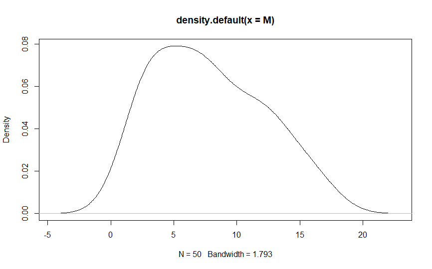

### 创建随机数

正态分布随机数生成函数的基本用法

rnorm（n,mean=0,sd=1）

n是随机数的个数，mean时均值，sd为标准差，默认为1

```R
> rnorm(5)
[1] -0.2361415  0.0438047  0.3178455 -0.9610114 -0.3033898

> rnorm(5,mean = 10,sd=1.5)
[1]  7.866078  9.291722 10.349936  9.016798 10.128163

> x<-rnorm(500,mean = 10,sd=1.5)
> plot(density(x))
```

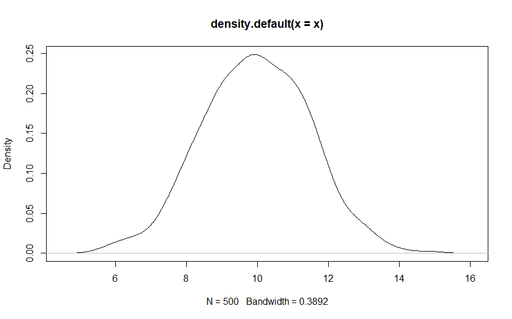

如果要生成的随机数重复可以使用

```r
> set.seed(101)
> rnorm(3)
[1] -0.3260365  0.5524619 -0.6749438

> rnorm(3)
[1] 0.2143595 0.3107692 1.1739663
> set.seed(101)
> rnorm(3)
[1] -0.3260365  0.5524619 -0.6749438
```

### 数据汇总

#### tabel函数统计频数

table的功能：统计观测值出现的频数

用法：


其中，。。。表示一个或多个能够被理解为因子的对象，适合于考察类别型变量的统计分布。

eg1:

```r
> table(mtcars$cyl)

 4  6  8 
11  7 14 
```

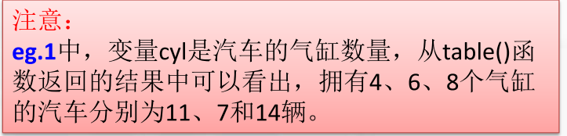

eg2:

```r
> cyl<-mtcars$cyl
> cyl
 [1] 6 6 4 6 8 6 8 4 4 6 6 8 8 8 8 8 8 4 4 4 4 8 8 8 8 4 4 4 8 6 8
[32] 4
> gear<-mtcars$gear
> gear
 [1] 4 4 4 3 3 3 3 4 4 4 4 3 3 3 3 3 3 4 4 4 3 3 3 3 3 4 5 5 5 5 5
[32] 4
> table(cyl,gear)
   gear
cyl  3  4  5
  4  1  8  2
  6  2  4  1
  8 12  0  2
```

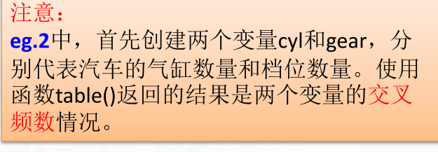

```r
> as.data.frame(table(cyl,gear))
  cyl gear Freq
1   4    3    1
2   6    3    2
3   8    3   12
4   4    4    8
5   6    4    4
6   8    4    0
7   4    5    2
8   6    5    1
9   8    5    2
```


#### addmargins()函数统计合计

eg4:

```r
> addmargins(table(cyl,gear),c(1,2))
     gear
cyl    3  4  5 Sum
  4    1  8  2  11
  6    2  4  1   7
  8   12  0  2  14
  Sum 15 12  5  32
```


#### prop.table()函数统计比例

eg5：

```r
> prop.table(table(cyl,gear),1)
   gear
cyl          3          4          5
  4 0.09090909 0.72727273 0.18181818
  6 0.28571429 0.57142857 0.14285714
  8 0.85714286 0.00000000 0.14285714
```


#### （重点）aggregate()函数

### 基本绘图

#### 通用成对数据绘图函数plot()

```r
> x<-1:10
> x
 [1]  1  2  3  4  5  6  7  8  9 10
> y<-x^2
> y
 [1]   1   4   9  16  25  36  49  64  81 100
> plot(x,y,main = "Generic X-Y Plotting",type = "b",lty=3,pch=1,cex=2,lwd=3)
```

主标题（main），自定义绘图类型（type）、线性（lty）、绘图符号（pch）、符号大小（pch）、符号大小（cex）、线宽（lwd）等参数

#### 绘图设备

在指定设备画图

windows()和x11()

```r
> windows()
> plot(x,y,main = "Generic X-Y Plotting",type = "b",lty=3,pch=1,cex=2,lwd=3)
```

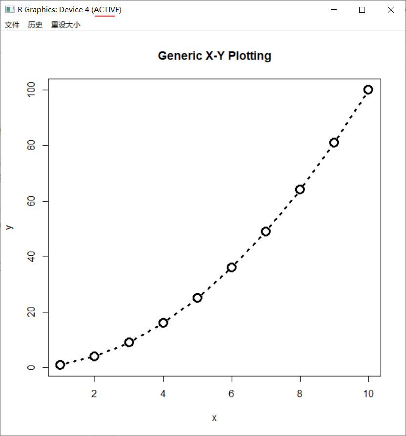

后打开的未激活状态

```r
dev.list() 查看所有开启的图形设备
```

```r
graphics.off()      关闭图形设备
```

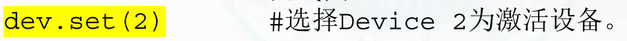


#### 绘图区、图形区和边界

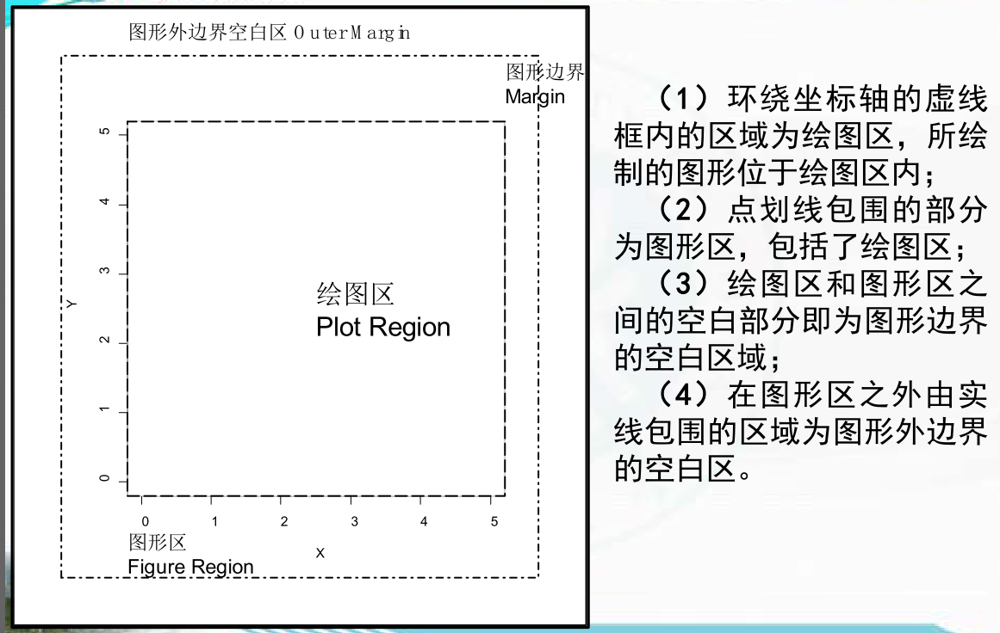

#### 图形分割函数layout()

```r
> mat<-matrix(1:4,2,2)
> mat
     [,1] [,2]
[1,]    1    3
[2,]    2    4
> x<-layout(mat)
> x
[1] 4
> layout.show(x)
```

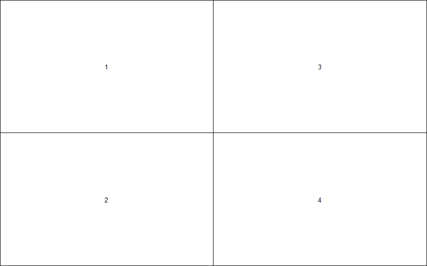

```r
> plot(y,sin(y))
> plot(y,cos(y))
> plot(y,y^2)
> plot(y,y^3)
```

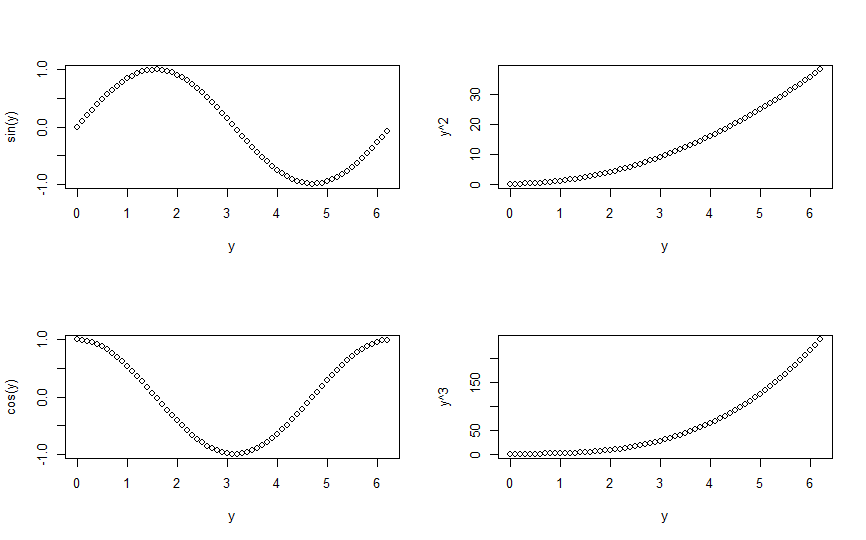

```r
> mat<-matrix(c(1,1,2,3),2,2)
> mat
     [,1] [,2]
[1,]    1    2
[2,]    1    3
> layout(mat)
> layout.show(layout(mat))
> y<-seq(0,2*pi,0.1)
> plot(y,sin(y))
> plot(y,cos(y))
> plot(y,y^2)
```

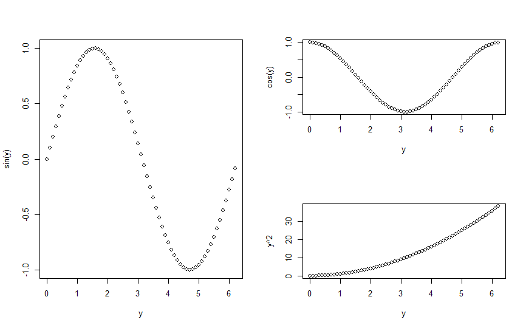

面积不等的分割，可以指定分割的高和宽

```r
> mat<-matrix(1:4,2,2)
> x<-layout(mat,widths = c(1:2),heights = c(2,1))
> layout.show(x)
```


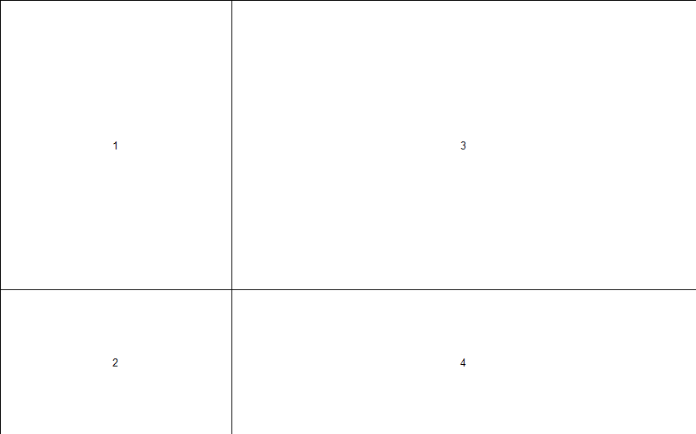

​		

### 绘图进阶

plot()函数是对多种对象进行绘图的泛型函数，他会识别作图对象的类别来进行绘图。

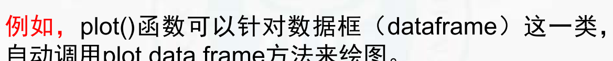

##### 一族plot()函数 		

```r
> methods(plot)
 [1] plot.acf*           plot.data.frame*    plot.decomposed.ts*
 [4] plot.default        plot.dendrogram*    plot.density*      
 [7] plot.ecdf           plot.factor*        plot.formula*      
[10] plot.function       plot.hclust*        plot.histogram*    
[13] plot.HoltWinters*   plot.isoreg*        plot.lm*           
[16] plot.medpolish*     plot.mlm*           plot.ppr*          
[19] plot.prcomp*        plot.princomp*      plot.profile.nls*  
[22] plot.raster*        plot.spec*          plot.stepfun       
[25] plot.stl*           plot.table*         plot.ts            
[28] plot.tskernel*      plot.TukeyHSD*     
see '?methods' for accessing help and source code
```


#### plot()针对不同的对象绘图

```r
> windows()
> par(mfrow=c(2,2))
> plot(1:10,main = "missing y")
> plot(sin,-pi,pi,ylab = "sin(x)",main="fuction")
> plot(cars,main="cars")
> plot(PlantGrowth$group,PlantGrowth$weight)
```

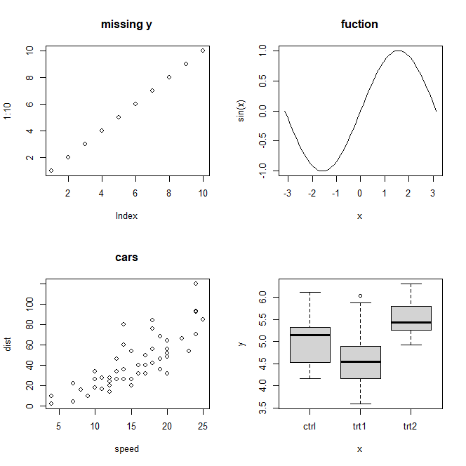

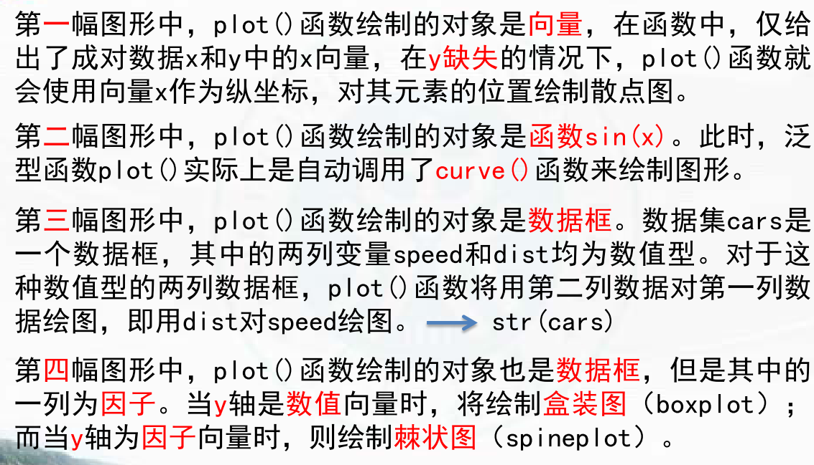

y轴为因子时：

```r
>plot(PlantGrowth$weight,PlantGrowth$group,xlab="weight",ylab="group",main="view")
```

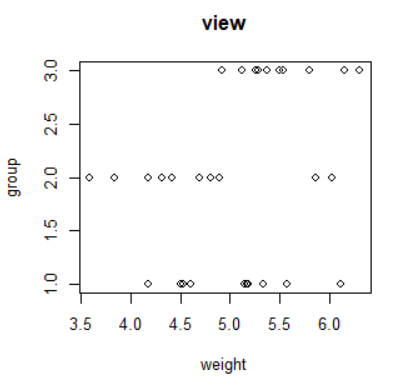

数据框的列数大于2时，函数的绘图结果：

```r
> newmtcars<-mtcars[,c(1,4,6)]
> str(newmtcars)
'data.frame':	32 obs. of  3 variables:
 $ mpg: num  21 21 22.8 21.4 18.7 18.1 14.3 24.4 22.8 19.2 ...
 $ hp : num  110 110 93 110 175 105 245 62 95 123 ...
 $ wt : num  2.62 2.88 2.32 3.21 3.44 ...
> plot(newmtcars)
```

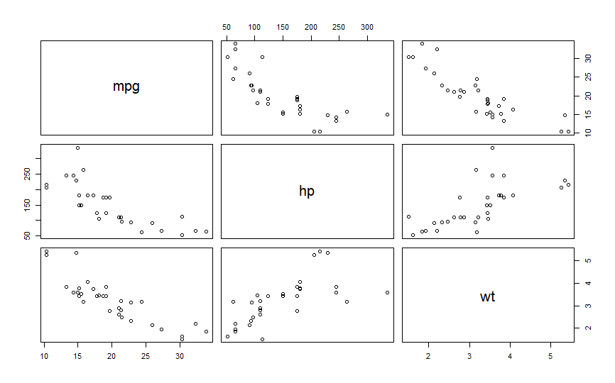

#### plot()分组数据的散点图

```r
> attach(mtcars)
The following objects are masked _by_ .GlobalEnv:

    cyl, gear

The following objects are masked from mtcars (pos = 3):

    am, carb, cyl, disp, drat, gear, hp, mpg, qsec, vs, wt

> unique(cyl)
[1] 6 4 8
> cylf<-as.factor(cyl)
> cylf
 [1] 6 6 4 6 8 6 8 4 4 6 6 8 8 8 8 8 8 4 4 4 4 8 8 8 8 4 4 4 8 6 8
[32] 4
Levels: 4 6 8

> str(cylf)
 Factor w/ 3 levels "4","6","8": 2 2 1 2 3 2 3 1 1 2 ...
> mode(cylf)
[1] "numeric"
虽然cylf时因子变量，但是存储的时候是数值存储的

> as.integer(cylf)   转换成整数
 [1] 2 2 1 2 3 2 3 1 1 2 2 3 3 3 3 3 3 1 1 1 1 3 3 3 3 1 1 1 3 2 3
[32] 1
#绘图
```

ifelse（）函数

```r
> attach(mtcars)
The following objects are masked _by_ .GlobalEnv:

    cyl, gear

> newwhp<-ifelse(hp>100,"blue","red")
> newwhp
 [1] "blue" "blue" "red"  "blue" "blue" "blue" "blue" "red"  "red" 
[10] "blue" "blue" "blue" "blue" "blue" "blue" "blue" "blue" "red" 
[19] "red"  "red"  "red"  "blue" "blue" "blue" "blue" "red"  "red" 
[28] "blue" "blue" "blue" "blue" "blue"
> plot(wt,mpg,col=newwhp,pch=16,main = "Mile")
```

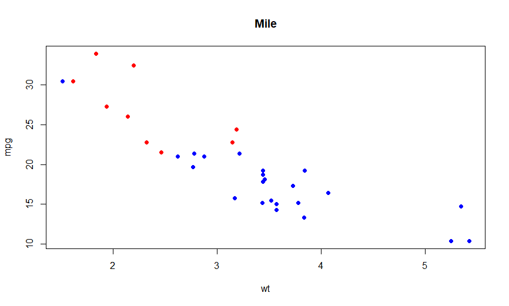

#### 处理数据点重叠性问题

刚样本数据太多的时候，数据绘图就会发生重叠

```r
> set.seed(100)
> x<-rnorm(500,0,1)
> m<-rnorm(500,0,1)
> m<-rnorm(500,2,3)
> n<-rnorm(500,1,1)
> y1<-2*x+m
> y2<-x-n
> Y<-c(y1,y2)
> X<-c(x,x)
> Z<-as.data.frame(cbind(X,Y))
> with(Z,plot(X,Y))
```

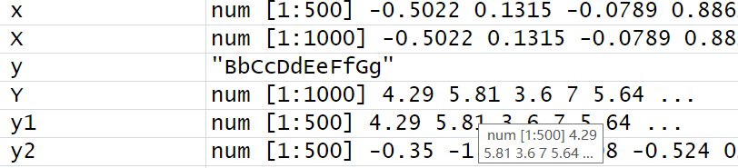


cbind组合成1000*2

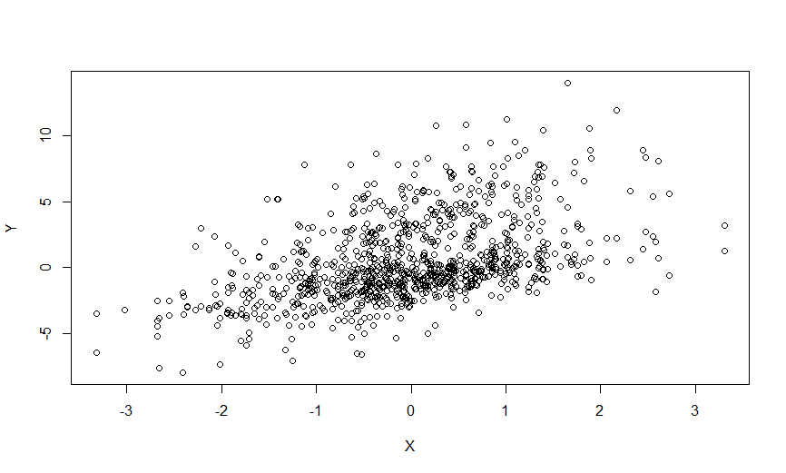

不同颜色解决重叠问题

```r
> Z$colors<-ifelse(as.numeric(rownames(Z)) <= 500,"red","blue")
> with(Z,plot(X,Y,col=colors))
```

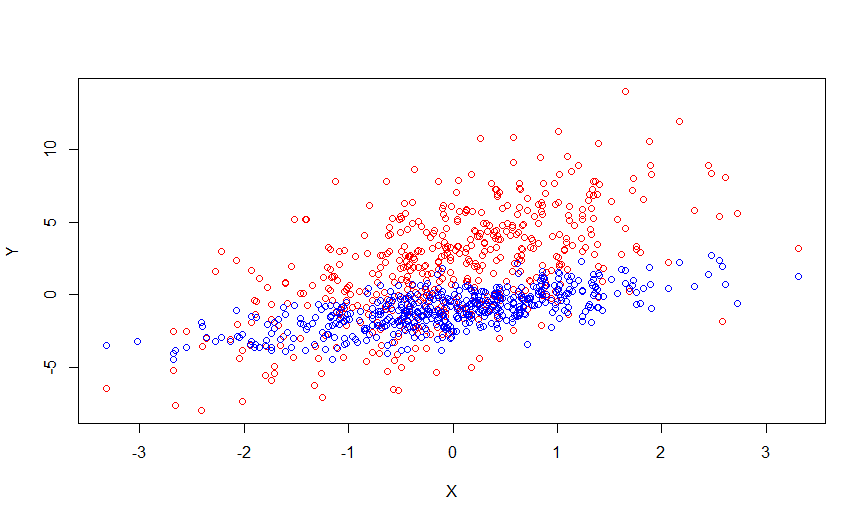

#### pie()函数绘制饼图

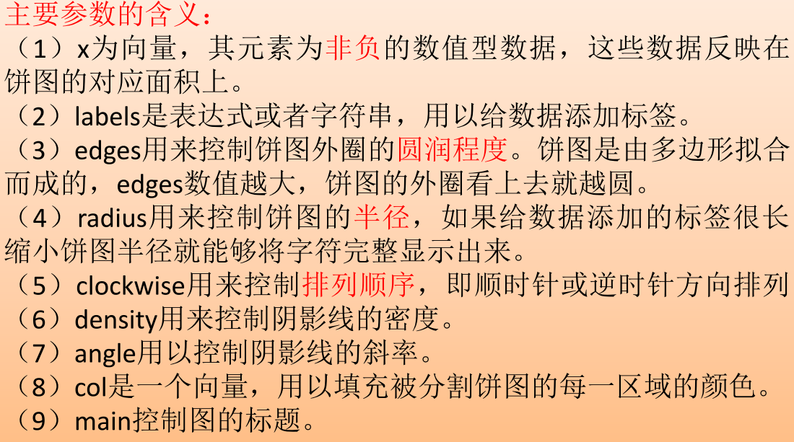

```r
> pie(c(10,20,30,40),col = rainbow(4),labels = c("10%","20%","30%","40%"),main="PIE")
```

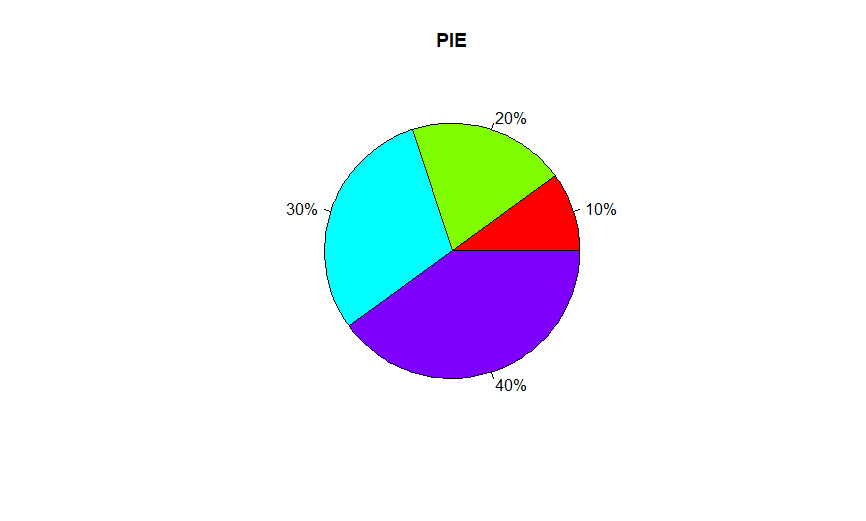

#### 		barplot()函数绘制柱状图

​	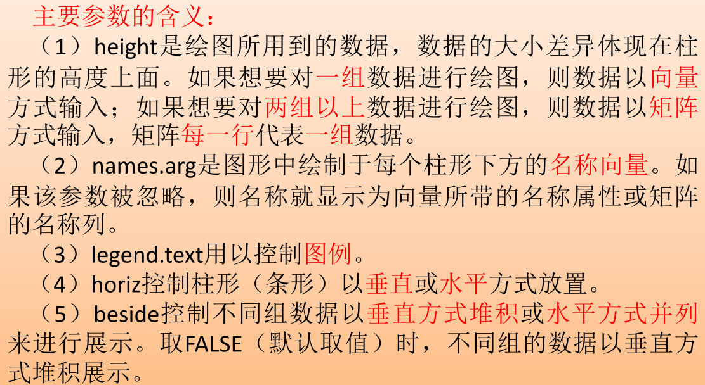

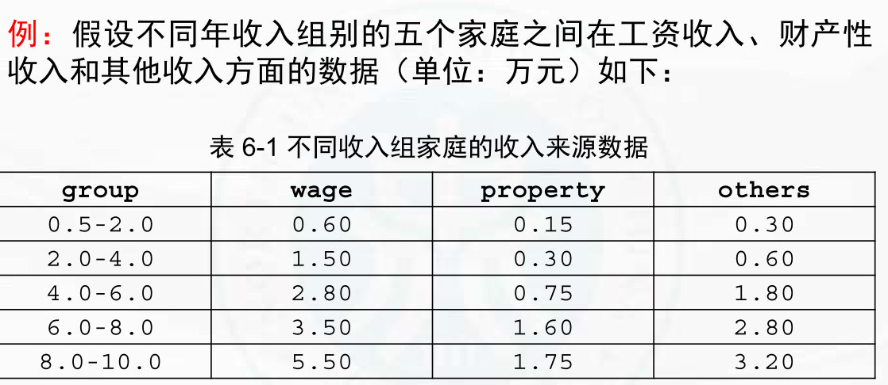

对向量绘制

```r
> first<-c(0.6,0.15,0.3)
> 
> income<-c("wage","property","others")
> par(mfrow=c(2,2))
> barplot(first,main="Default")
> barplot(first,names.arg=income,density = 10,angle = 30,main="Default")
> barplot(first,horiz = TRUE,main="Default")
> x<-barplot(first,col=c("red","green","blue"),ylim = c(0,0.8),main = "colors&value")
> x
     [,1]
[1,]  0.7
[2,]  1.9
[3,]  3.1
> text(x,first+0.1,labels = as.character(first))
在最后一个图上面添加文字，+0.1是在上面添加
```

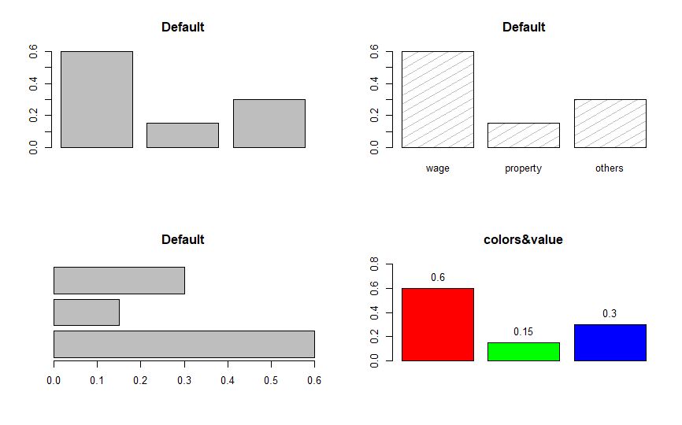

对矩阵作图

#### hist()函数绘制直方图

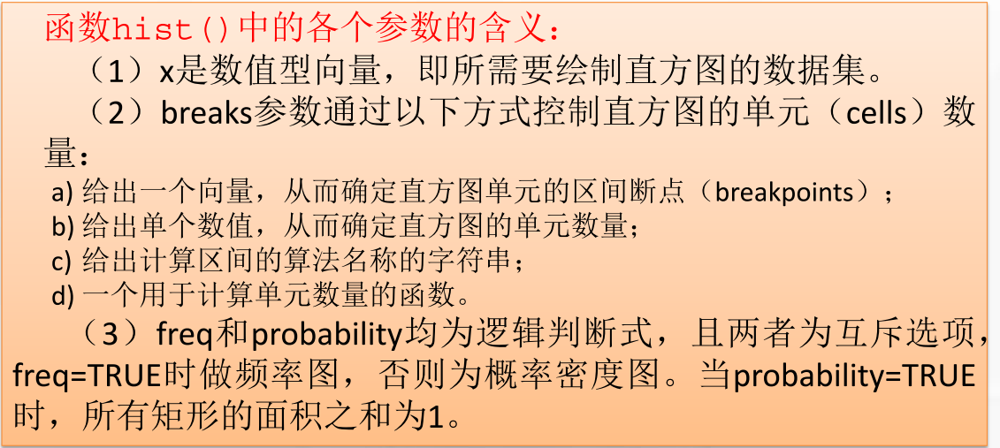

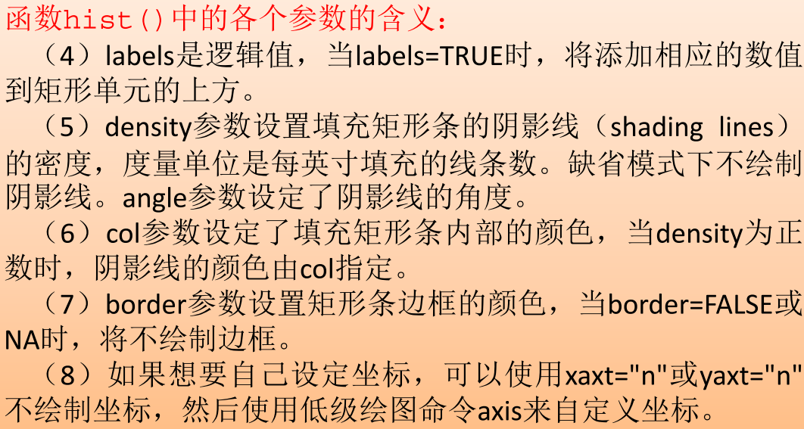

```r
> attach(USArrests)
> hist(Murder)
> str(hist(Murder))
List of 6
 $ breaks  : num [1:10] 0 2 4 6 8 10 12 14 16 18
 $ counts  : int [1:9] 1 12 8 7 7 4 6 3 2
 $ density : num [1:9] 0.01 0.12 0.08 0.07 0.07 0.04 0.06 0.03 0.02
 $ mids    : num [1:9] 1 3 5 7 9 11 13 15 17
 $ xname   : chr "Murder"
 $ equidist: logi TRUE
 - attr(*, "class")= chr "histogram"
> hist(Murder,freq = FALSE,labels = TRUE,ylim = c(0,0.15),xlim=c(0,20),xaxt="n",density = 8,angle = 60)
> axis(1,seq(0,20,by=2)) 图形下面绘制线
> density(USArrests$Murder)

Call:
	density.default(x = USArrests$Murder)

Data: USArrests$Murder (50 obs.);	Bandwidth 'bw' = 1.793

       x                y            
 Min.   :-4.578   Min.   :5.639e-05  
 1st Qu.: 2.261   1st Qu.:5.526e-03  
 Median : 9.100   Median :3.592e-02  
 Mean   : 9.100   Mean   :3.652e-02  
 3rd Qu.:15.939   3rd Qu.:6.364e-02  
 Max.   :22.778   Max.   :7.908e-02  
```

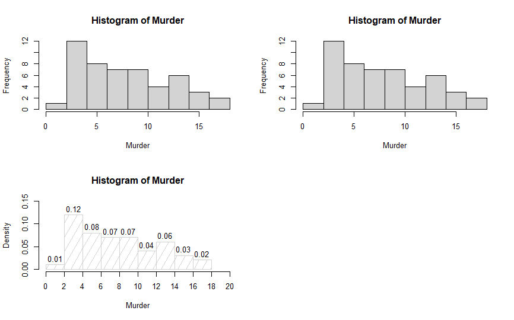

#### bosplot()函数绘制箱线图

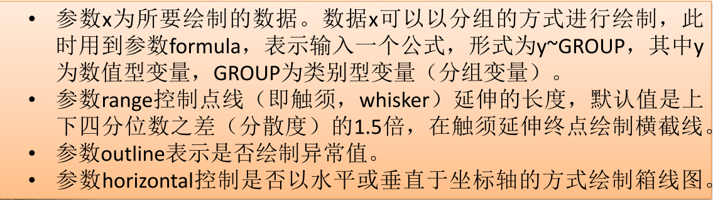

```r
> boxplot(mtcars$mpg,ylab="mpg",main="Motor")
> summary(mtcars$mpg)
   Min. 1st Qu.  Median    Mean 3rd Qu.    Max. 
  10.40   15.43   19.20   20.09   22.80   33.90 
```

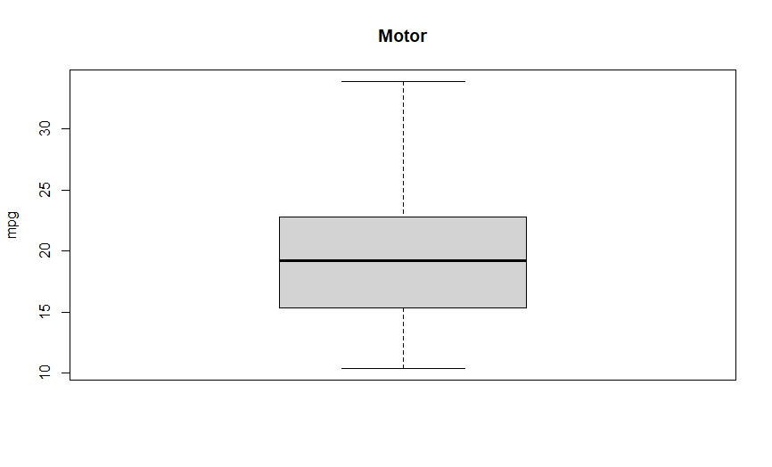

虚线即触须

```r
boxplot(mtcars$mpg~mtcars$cyl,xlab = "cyl",ylab="mpg",main="Motor")
```

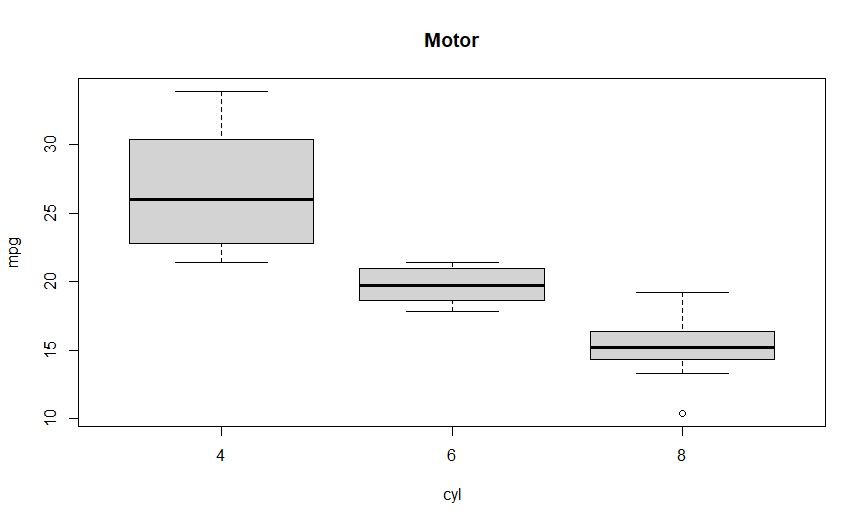

8气缸存在异常值，空心圆点

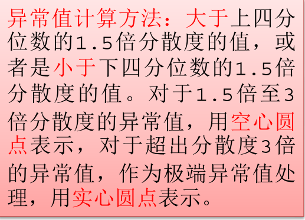

### 绘图进阶-绘制三维信息模型

#### contour()函数绘制等高线图

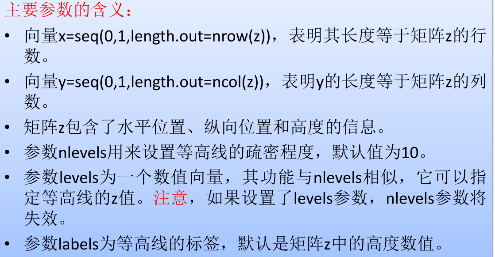

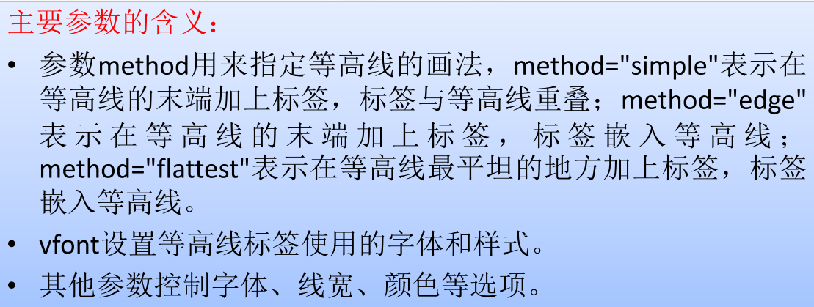

```r
> contour(volcano,nlevels=8,method = "flattest",lwd = 2,labcex = 0.8,vfont = c("sans serif","italic"),col="blue")
```

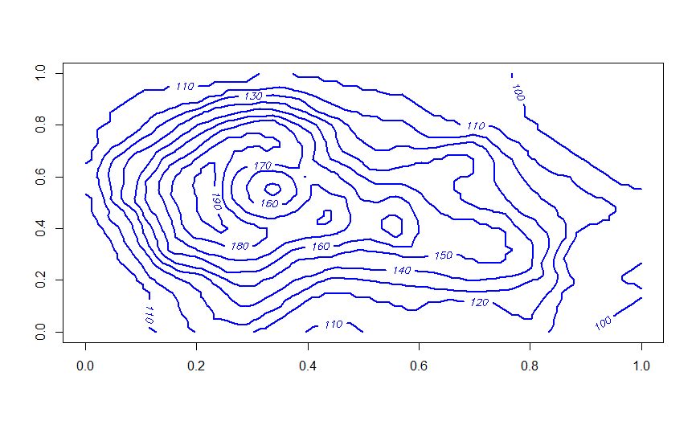

#### plot3d()函数绘制三维散点图

```r
install.packages("rgl")
```

如果下载包出错，更改为国内镜像解决

```r
> library(rgl)
Warning message:
程辑包‘rgl’是用R版本4.0.3 来建造的 
> attach(mtcars)
The following objects are masked _by_ .GlobalEnv:

    cyl, gear

> plot3d(wt,hp,mpg,type="s",size = 1.5,col = "blue")
> detach(mtcars)
```

可动的三维图形

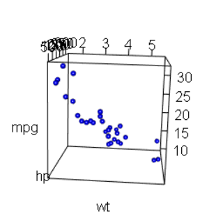

#### symbols()函数绘制气泡图和温度计图

二维平面反应三维信息

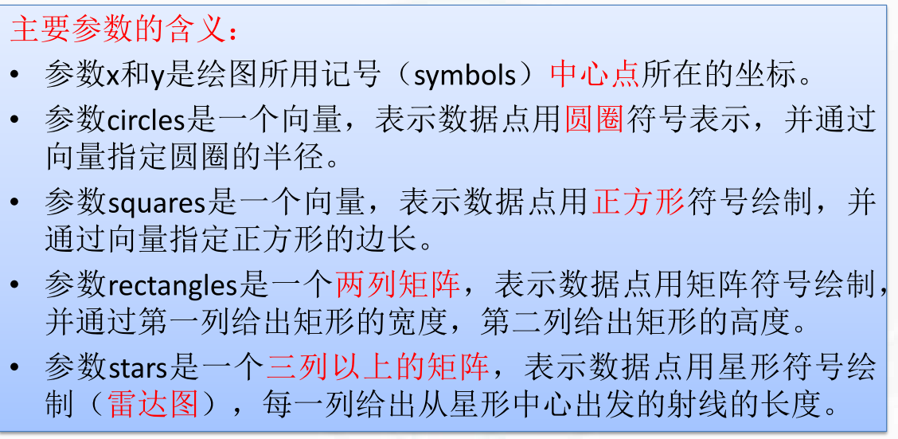

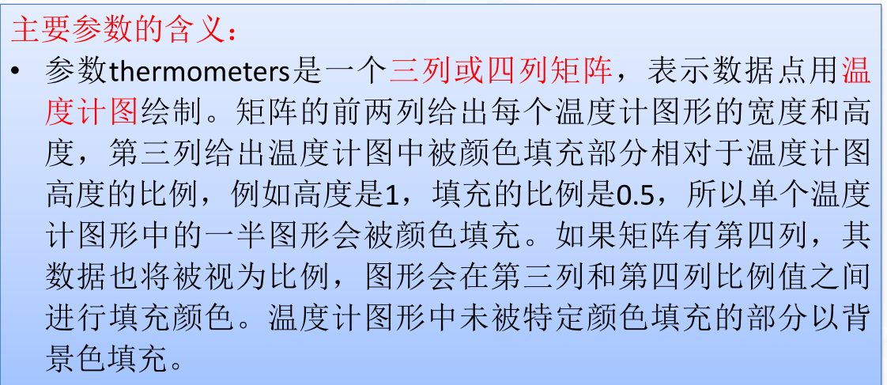


```r
> attach(mtcars)
The following objects are masked _by_ .GlobalEnv:

    cyl, gear

> symbols(wt,hp,circles = mpg,inches = 0.3,fg="white",bg="lightgrey",xlab = "weight",ylab="Gross")
> text(wt,hp,rownames(mtcars),cex)
Error in text.default(wt, hp, rownames(mtcars), cex) : 找不到对象'cex'
> text(wt,hp,rownames(mtcars),cex=0.6)
> detach(mtcars)
```

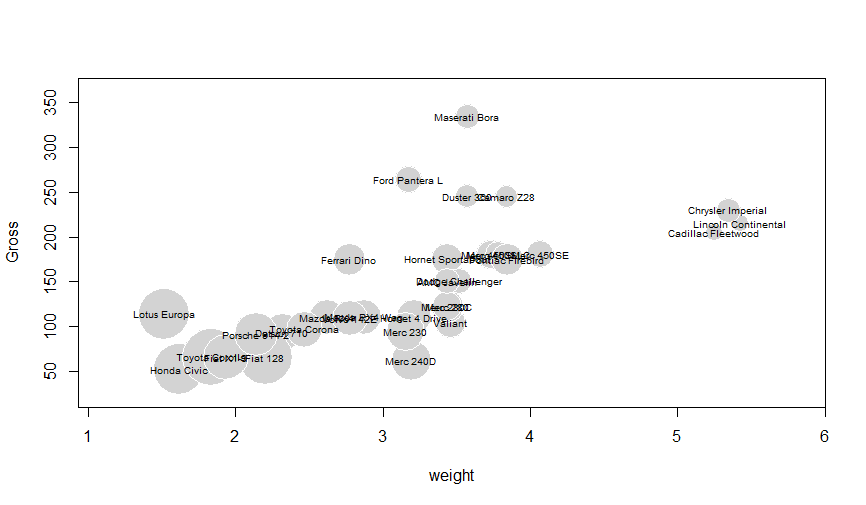

```r
> n <- mtcars[mtcars$gear==5,]
> symbols(n$wt,n$hp,thermometers = cbind(0.5,1,n$mpg/50),inches = 0.8,xlab="Weight(lb/1000)",ylab = "Gross horsepower")
> n$mpg
[1] 26.0 30.4 15.8 19.7 15.0
> text(n$wt,n$hp+15,rownames(n),cex = 1)
> detach(mtcars)
```

**n$mpg大小在10到30，除以50保持在0到1之间**

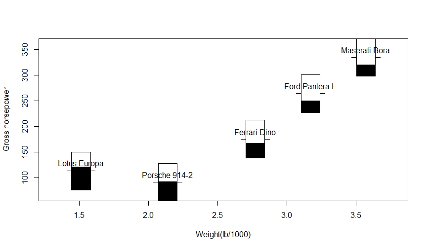

#### persp()函数绘制3D表面图

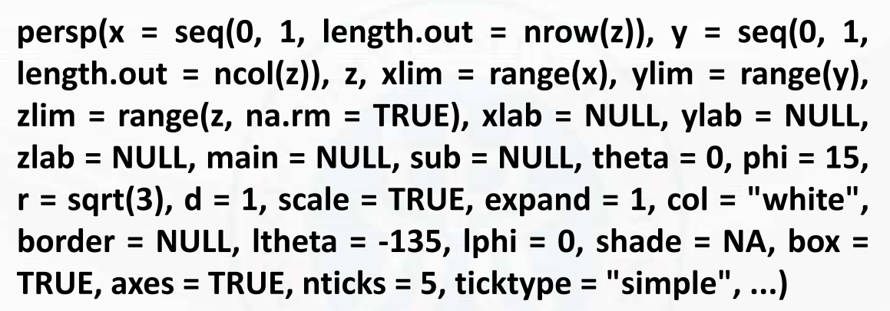

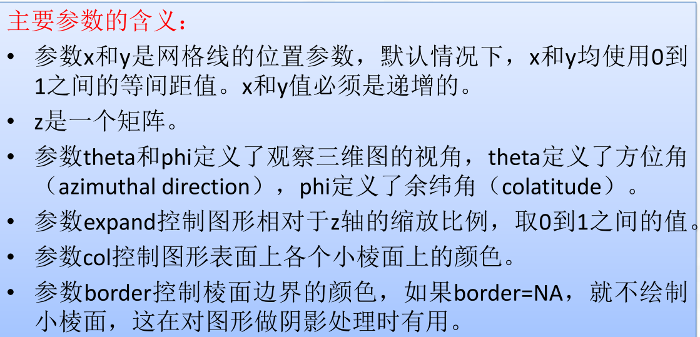


```r
> str(volcano)
 num [1:87, 1:61] 100 101 102 103 104 105 105 106 107 108 ...
> x<-seq(0,1,length = 87)生成等距离的点
> y<-seq(0,1,length=61)
> persp(x,y,volcano,theta = 30,phi=30,expand = 0.5)
```

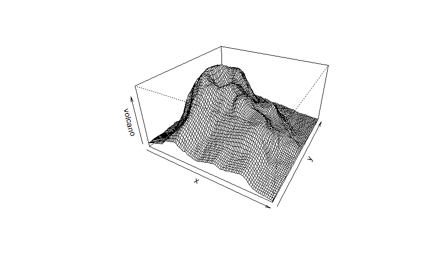

#### image()函数绘制三维图形


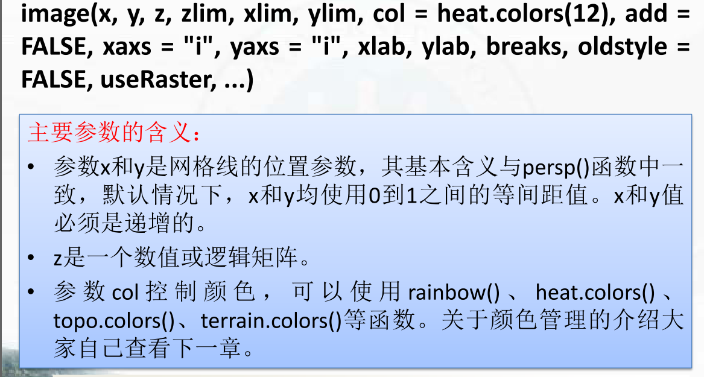

灰度图

```r
> x<-seq(0,1,length = 87)
> y<-seq(0,1,length=61)
> image(x,y,volcano,col = gray((20:50)/50))
```

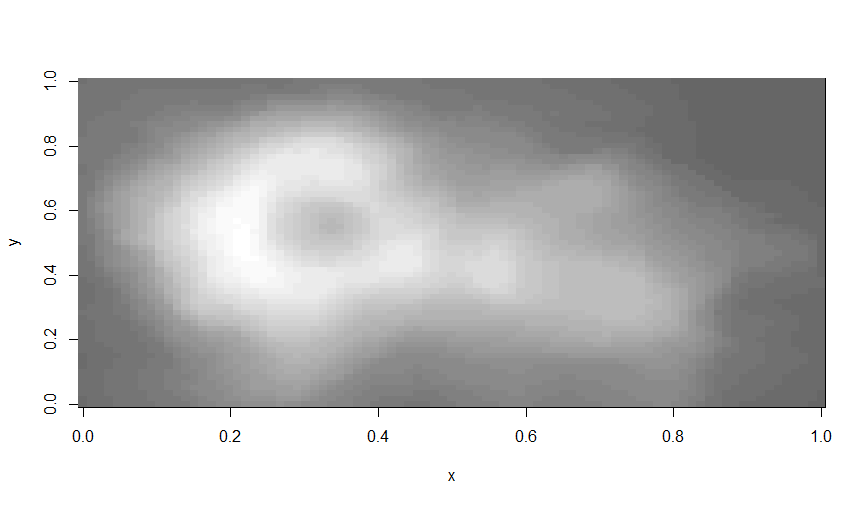

在灰度图上添加等高线

```r
> contour(x,y,volcano,levels = seq(90,200,by=5),add=TRUE,col="red")
```

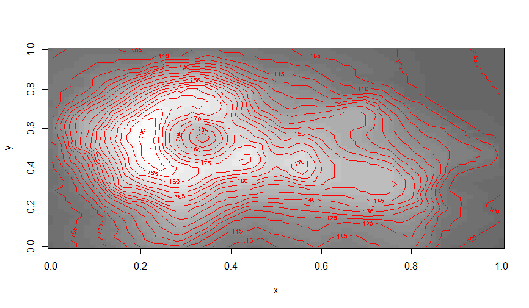

