# C++

### 数据编码表示

正整数是用正常二进制码表示的

负整数用补码表示

#### 原码的缺点

1、0的表示不唯一

2、进行四则运算时，符号位需单独处理且运算规则复杂

#### 补码

1、0的表示唯一

2、符号位可作为数值参加运算

3、减法运算可转化为加法运算

#### 模数

n位二进制整数的模数位$ 2^n$

n位小数的模数为2

#### 补数

一个数减去另一个数（加一个负数）

等于第一个数加第二个数的补数

eg：时钟指针

$8+（-2）=8+10（mod 12）=6$

#### 补码的计算规则

反码：作为中间码

负数补码=反码+1

正数补码=原码

1、负整数

原码符号位不变（仍是1）

其余各位取反（0变1，1变0）

eg：

x = -1100110

x原=11100110

x反=10011001

2、正整数：原码就是补码、反码

#### 补码的优点

0的表示唯一

符号位可作为数值参加运算

补码运算的结果仍为补码

**补码在求补即可得到原码**

**如果负数之和得正数或正数之和得负数说明运算结果溢出，数据有一个表示范围，比如一个8位二进制，超出范围会把最高位顶出去，改变正负号，也就是溢出**

#### 定点方式表示小数

一个32位得数，以点为分界线，一半是小数，一半是整数

缺点：特别大得数和特别小得数不好表示，现在已经弃用

#### 实数得浮点表示

计算机中通常采用浮点方式表示小数（小数点浮动得方式表示小数）

$N = M * 2^E $

E:2的幂次，成为N的阶码，反映了该浮点数的数据范围

M：N的尾数，其位数反映了数据的精度

数据溢出时2的阶码溢出

#### 字符在计算机中的表示

ASCII码：

7位二进制表示一个字符，最多可以表示$2^7=128$个字符

汉字编码：

中国国家标准

##### 习题

255(10)转换为二进制为____


0.101(2)转化为十进制为____


## c++简单程序设计

### c++的特点

从 c语言发展来的，叫为带类的c

```c++
cout<<""<<endl;
return 0
```

<<是一个流插入运算符

return 0返回一个函数的运算结果，主函数没什么需要返回的就返回0	

### 基本数据类型、常量、变量

#### 基本数据类型

整数类型

实数类型

字符类型

布尔类型

#### 常量

在源程序中直接写明的数据

其值在整个程序运行期间不可改变

#### 变量

在程序运行过程中允许改变的数据

#### 整数类型

基本整数类型：int

按符号分：

符号的（signed）默认是有符号的

无符号的（unsigned）有些符号的是无符号的

按数据范围分：
短整数（short）

长整数（long）

长长类型（long long）

**c++没有明确规定每种数据类型的字节数和取值范围，他只是规定他们之间的字节数大小的顺序满足：**

**（signed/unsigned）signed char**

**《 （unsigned）short int**

**《（unsigned）int**

**《（unsigned）long int**

**《 long long int**

#### 浮点数类型：

单精度（float）

双精度（double）

扩展精度（long double）

#### 字符串类型

有字符串常量

基本类型中没有字符串变量

采用字符数组存储字符串（c风格的字符串）

#### 布尔类型（bool）

只有两个值：true（真）、false（假）

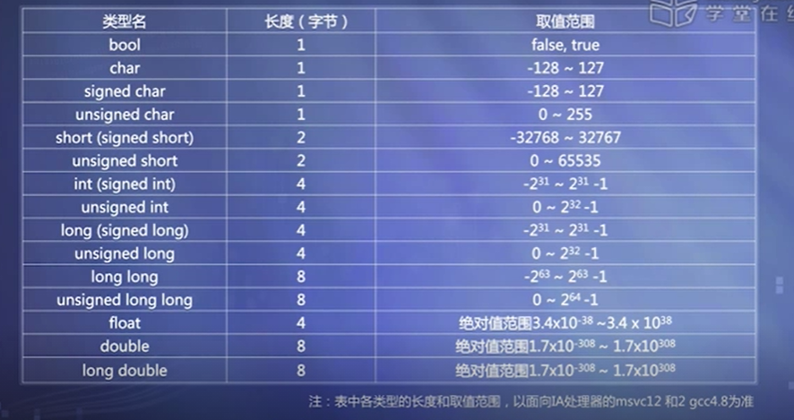

这只是特定环境下的一种范围

#### 整数常量

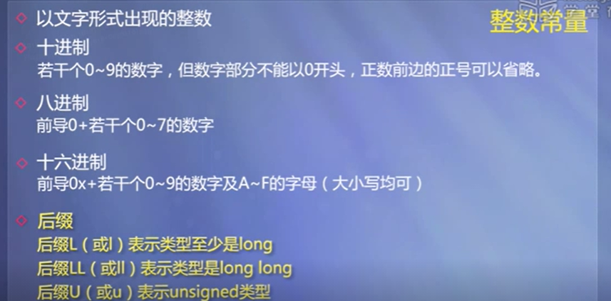

#### 浮点数常量

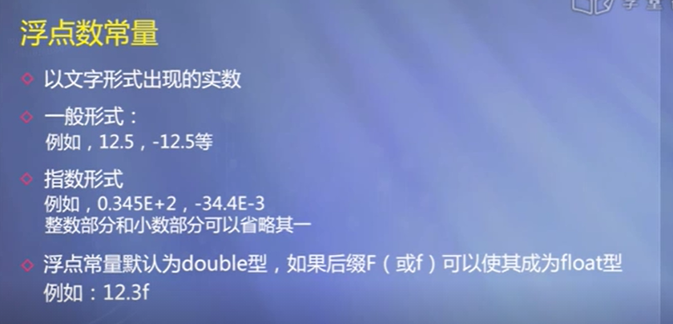

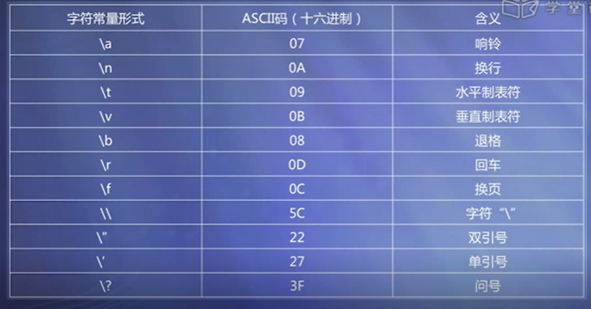

#### c风格字符串常量

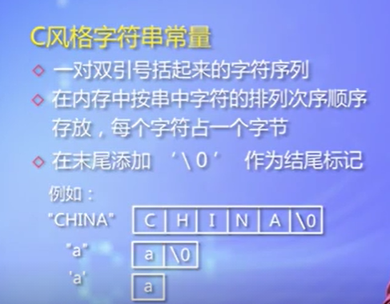

通过添加前缀可以改变字符常量或者字符串常量的类型


#### 变量

接受数据的变化

#### 数据初始化

定义数据类型，在函数体外定义的变量叫全局变量，全局变量不给初始值，数值类型默认初始化为0

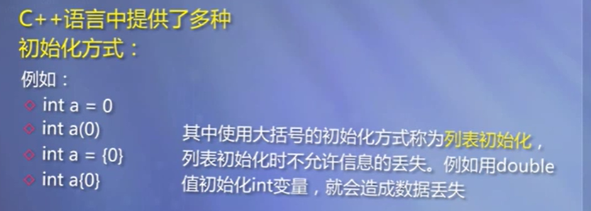

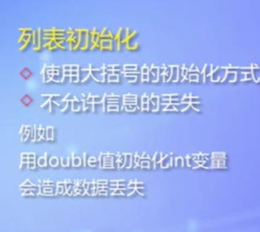

小数点后面的值会丢失。

#### 符号常量

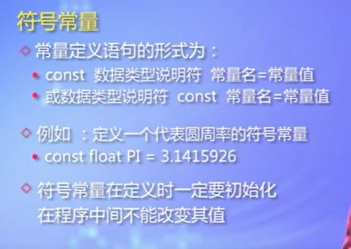

const定义的常量也会跟内存空间结合，const定义之后可以用这个名字来访问这组内存空间，这种访问变成只读，不能改写，但是必须给初始值，否则系统会报错

#### 程序举例

**题目：读入并显示整数**

l  主要知识点：

n 常量

u  在源程序中直接写明的数据，其值在整个程序运行期间不可改变，这样的数据称为常量。

n  变量

u  在运行过程中从计算机的外部设备（例如键盘、硬盘）读取的，这些数据的值在程序运行过程中允许改变，这样的数据称为变量

n  从键盘输入数据

u  iostream类的对象cin的>>操作，可以从标准输入设备（通常是键盘）读入数据

n  数据的存储

u  为了存储数据，需要预先为这些数据分配内存空间。

u  变量的定义就是在给变量命名的时候分配内存空间。

l  源代码

\#include <iostream>

using namespace std;

int main()

{

​     int radius;    

​     cout<<"Please enter the radius!\n";

​     cin>>radius;   

​     cout<<“The radius is:”<<radius<<‘\n’;   

​        cout<<“PI is:”<<3.14<<‘\n’;

​     cout<<"Please enter a different radius!\n";

​     cin>>radius;   

​     cout<<"Now the radius is changed to:" 

​             <<radius<<‘\n’;

​     return 0;

}

 

**题目：为常量命名**

l  主要知识点：符号常量

l  源代码

\#include <iostream>

using namespace std;

int main()

{   const double pi(3.14159);           

​     int radius;       

​     cout<<"Please enter the radius!\n";

​     cin>>radius;   

​     cout<<"The radius is:"<<radius<<'\n';     

​     cout<<"PI is:"<<pi<<'\n';            

​     cout<<"Please enter a different radius!\n";

​     cin>>radius;   

​     cout<<"Now the radius is changed to:"<<radius<<'\n';

​     cout<<"PI is still:"<<pi<<'\n‘;

​     //cin>>pi;

​     return 0;

}

l  运行结果：

Please enter the radius!

2

The radius is:2

PI is:3.14159

Please enter a different radius!

3

Now the radius is changed to:3

PI is still:3.14159

 

**题目：变量的初始化**

l  主要知识点：变量的初始化

n  虽然变量的值是可以在运行时获得的，但是在定义变量时也可以进行初始化，而且应该提倡进行初始化；

n  未经初始化的变量，其值可能是随机的。如果误用了未经初始化也没有给予确定值的变量，就会引起错误。

l  源代码

\#include <iostream>

using namespace std;

int main()

{

​     const double pi(3.14159);           

​     int radius(0);  

​     cout<<"The initial radius is:"<<radius<<'\n';         

​     cout<<"PI is:"<<pi<<'\n‘; 。

​     cout<<"Please enter a different radius!\n";

​     cin>>radius;   

​     cout<<"Now the radius is changed to:"<<radius<<'\n';

​     cout<<“PI is still:”<<pi<<‘\n’;     

​     return 0;

}   

### 运算与表达式

#### 算数运算与赋值运算

**算术运算**

l  基本算术运算符

n  +  -  *  /(若整数相除，结果取整)

n  %（取余，操作数为整数）

l  优先级与结合性

n  先乘除，后加减，同级自左至右

l  ++, --（自增、自减）

n  例：i++;    --j;

**赋值运算**

l  将值赋给变量

l  赋值运算符“=”

l  赋值表达式：

n  用赋值运算符连接的表达式

n  例：

n=5

n = n + 5

n  表达式的值
赋值运算符左边对象被赋值后的值

n  表达式的类型
赋值运算符左边对象的类型

l  复合的赋值运算符

n  +=，-=，*=，/=，%=，<<=，>>=，&=，^=，|=

n  例
a += 3 等价于 a = a + 3
x *= y + 8 等价于 x = x * (y + 8)

#### 逗号运算、关系运算、逻辑运算和条件运算

**逗号运算和逗号表达式**

l  格式

表达式1，表达式2

l  求解顺序及结果

n  先求解表达式1，再求解表达式2

n  最终结果为表达式2的值

l  例

a = 3 * 5 , a * 4   最终结果为60

**关系运算与关系表达式**

l 关系运算是比较简单的一种逻辑运算，优先次序为：

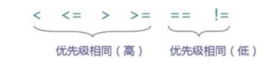

l  关系表达式是一种最简单的逻辑表达式

n  其结果类型为 bool，值只能为 true 或false。

例如：a > b，c <= a + b，x + y == 3

**逻辑运算与逻辑表达式**

l  逻辑运算符

​                 !(非)      &&(与)        ||(或)

优先次序：  高         →           低

l  逻辑运算结果类型：bool，值只能为 true 或false

l  逻辑表达式

例如：(a > b) && (x > y)

l  “&&”的运算规则

n   两侧表达式都为真，结果为真；

n  有一侧表达式为假，结果为假。

l  “&&” 的“短路特性”

表达式1 && 表达式2

n  先求解表达式1

n  若表达式1的值为false，则最终结果为false，不再求解表达式2

若表达式1的结果为true，则求解表达式2，以表达式2的结果作为最终结果

l  “||”的运算规则

n  两侧表达式都为假，结果为假；

n  有一侧表达式为真，结果为真。

l  “||” 的“短路特性”

表达式1 || 表达式2

n  先求解表达式1

n  若表达式1的值为true，则最终结果为true，不再求解表达式2

若表达式1的结果为false，则求解表达式2，以表达式2的结果作为最终结果

**条件运算符与条件表达式**

l  一般形式

n   表达式1？表达式2：表达式3

表达式1 必须是bool 类型

l  执行顺序

n  先求解表达式1，

n  若表达式1的值为true，则求解表达式2，表达式2的值为最终结果

若表达式1的值为false，则求解表达式3，表达式3的值为最终结果

l  条件运算符优先级高于赋值运算符，低于逻辑运算符

n  例

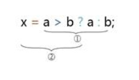

表达式1是bool类型，表达式2、3的类型可以不同，条件表达式的最终类型为2 和3 中较高的类型。

#### Sizeof运算、位运算

**sizeof运算**

l  语法形式
sizeof (类型名)
或 sizeof 表达式

l  结果值：
“类型名”所指定的类型，或“表达式”的结果类型所占的字节数。

l  例：

sizeof(short)

sizeof  x

**位运算——按位与（&）**

l  运算规则

将两个运算量的每一个位进行逻辑与操作

l  举例：计算3 & 5

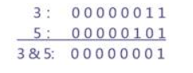

l  用途：

n  将某一位置0，其他位不变。
例如：将char型变量a的最低位置0: a = a & 0xfe; ;(0xfe:1111 1110)

n  取指定位。
例如：有char c; int a; 取出a的低字节，置于c中：c=a & 0xff; (0xff:1111 1111)

**位运算——按位或（|）**

l  运算规则

n  将两个运算量的每一个位进行逻辑或操作

l  举例：计算3 | 5

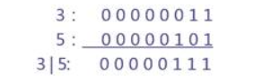

l  用途：

n  将某些位置1，其他位不变。
例如：将 int 型变量 a 的低字节置 1 ：
         a = a | 0xff;

**位运算——按位异或（^）**

l  运算规则

n  两个操作数进行异或：
若对应位相同，则结果该位为 0，
若对应位不同，则结果该位为 1，

l  举例：计算071^052

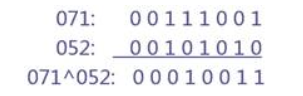

l  用途举例：使特定位翻转（与0异或保持原值，与1异或取反）

例如：要使 01111010 低四位翻转：

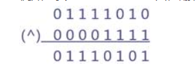

位运算——取反（~）

l  运算规则

n  单目运算符，对一个二进制数按位取反。

l  例：

 025：0000000000010101

 ~025：1111111111101010

**位运算——移位（<<、>>）**

n  左移运算（<<）（乘2）

左移后，低位补0，高位舍弃。

n  右移运算（>>）（除2）

右移后：

低位：舍弃

高位：

无符号数：补0

有符号数：补“符号位”


  