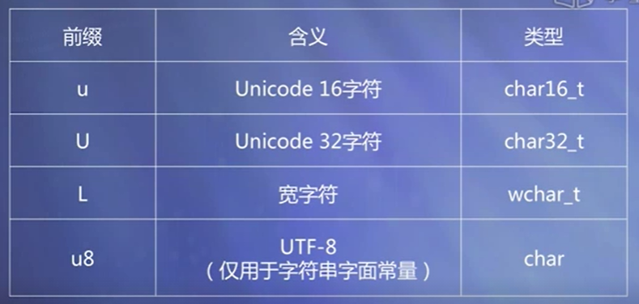

# C++

### 数据编码表示

正整数是用正常二进制码表示的

负整数用补码表示

#### 原码的缺点

1、0的表示不唯一

2、进行四则运算时，符号位需单独处理且运算规则复杂

#### 补码

1、0的表示唯一

2、符号位可作为数值参加运算

3、减法运算可转化为加法运算

#### 模数

n位二进制整数的模数位$ 2^n$

n位小数的模数为2

#### 补数

一个数减去另一个数（加一个负数）

等于第一个数加第二个数的补数

eg：时钟指针

$8+（-2）=8+10（mod 12）=6$

#### 补码的计算规则

反码：作为中间码

负数补码=反码+1

正数补码=原码

1、负整数

原码符号位不变（仍是1）

其余各位取反（0变1，1变0）

eg：

x = -1100110

x原=11100110

x反=10011001

2、正整数：原码就是补码、反码

#### 补码的优点

0的表示唯一

符号位可作为数值参加运算

补码运算的结果仍为补码

**补码在求补即可得到原码**

**如果负数之和得正数或正数之和得负数说明运算结果溢出，数据有一个表示范围，比如一个8位二进制，超出范围会把最高位顶出去，改变正负号，也就是溢出**

#### 定点方式表示小数

一个32位得数，以点为分界线，一半是小数，一半是整数

缺点：特别大得数和特别小得数不好表示，现在已经弃用

#### 实数得浮点表示

计算机中通常采用浮点方式表示小数（小数点浮动得方式表示小数）

$N = M * 2^E $

E:2的幂次，成为N的阶码，反映了该浮点数的数据范围

M：N的尾数，其位数反映了数据的精度

数据溢出时2的阶码溢出

#### 字符在计算机中的表示

ASCII码：

7位二进制表示一个字符，最多可以表示$2^7=128$个字符

汉字编码：

中国国家标准

##### 习题

255(10)转换为二进制为____


0.101(2)转化为十进制为____


## c++简单程序设计

### c++的特点

从 c语言发展来的，叫为带类的c

```c++
cout<<""<<endl;
return 0
```

<<是一个流插入运算符

return 0返回一个函数的运算结果，主函数没什么需要返回的就返回0	

### 基本数据类型、常量、变量

#### 基本数据类型

整数类型

实数类型

字符类型

布尔类型

#### 常量

在源程序中直接写明的数据

其值在整个程序运行期间不可改变

#### 变量

在程序运行过程中允许改变的数据

#### 整数类型

基本整数类型：int

按符号分：

符号的（signed）默认是有符号的

无符号的（unsigned）有些符号的是无符号的

按数据范围分：
短整数（short）

长整数（long）

长长类型（long long）

**c++没有明确规定每种数据类型的字节数和取值范围，他只是规定他们之间的字节数大小的顺序满足：**

**（signed/unsigned）signed char**

**《 （unsigned）short int**

**《（unsigned）int**

**《（unsigned）long int**

**《 long long int**

#### 浮点数类型：

单精度（float）

双精度（double）

扩展精度（long double）

#### 字符串类型

有字符串常量

基本类型中没有字符串变量

采用字符数组存储字符串（c风格的字符串）

#### 布尔类型（bool）

只有两个值：true（真）、false（假）


这只是特定环境下的一种范围

#### 整数常量


#### 浮点数常量


#### c风格字符串常量


通过添加前缀可以改变字符常量或者字符串常量的类型



#### 变量

接受数据的变化

#### 数据初始化

定义数据类型，在函数体外定义的变量叫全局变量，全局变量不给初始值，数值类型默认初始化为0


小数点后面的值会丢失。

#### 符号常量


const定义的常量也会跟内存空间结合，const定义之后可以用这个名字来访问这组内存空间，这种访问变成只读，不能改写，但是必须给初始值，否则系统会报错

