# HTML

## from表单

### input表单元素

###### name

name属性区别不同的表单元素。当前input的名字，后台通过这个name找到这个表单。

name属性后面的值是自定义的

一组表单必须命名相同的名字

###### checked

让某个按钮或者复选按钮处于选中状态使用属性checked

###### type

设置input表单为不同的形态（radio单选，password密码，text文本框，submit提交）

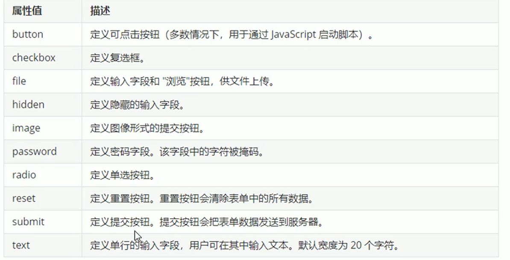

提交

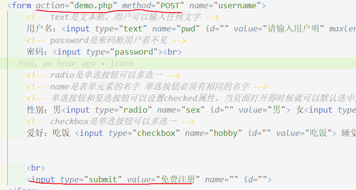

重置

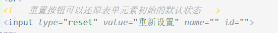

普通按钮和文件域

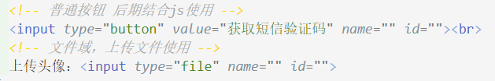

### label

label标签为input标签定义标注

label标签用于绑定一个表单元素，当点击label标签内的文本时，浏览器就会自动将焦点（光标）转到或者选择对应的表单元素增加用户体验

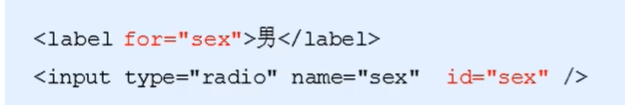

**核心:label标签的for属性应当与想关元素的id属性相同**

点击名字,不用点击圆点就能选中

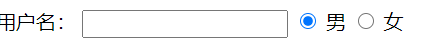

### select下拉表单元素

页面中有多个选项给用户选择，并且想要节约空间，可以用<select>下拉表单元素。

1、select里面至少包含一堆option

2、select里面可以定义selected="selected"，表示默认选中选项。

需要包含在表单元素from里面

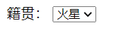

### textarea文本域

用户输入很多的时候就使用,定义多行文本的输入

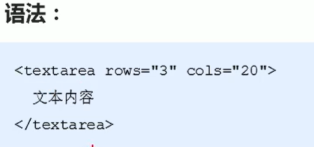

添加默认内容：

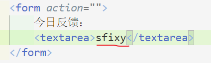

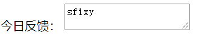

# CSS

**css主要由两部分构成：选择器以及一条或多条声明**

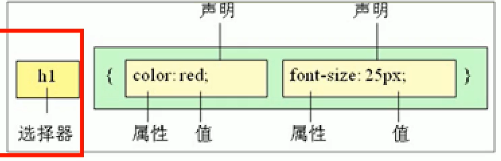

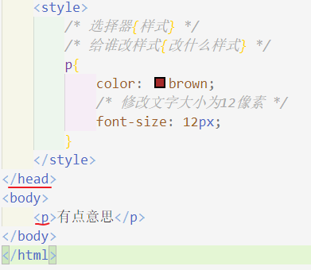

后面一定加分号结束

属性和属性值是以键值对形式存在的 

## css简介

### css代码风格

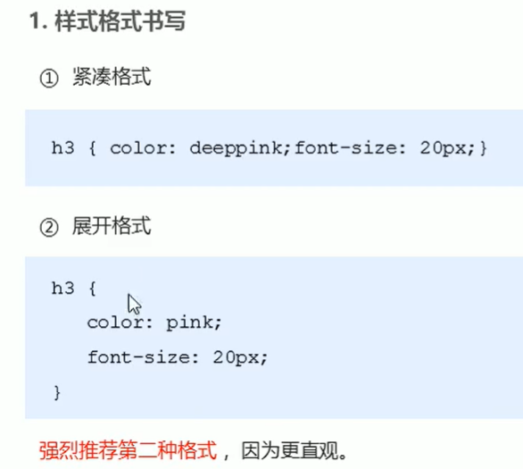

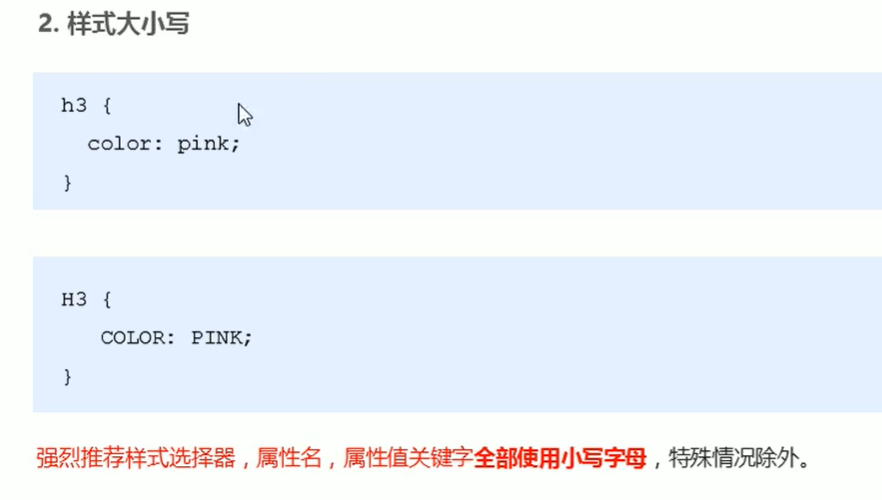

