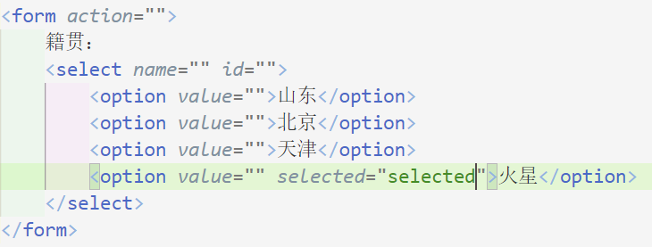

# HTML

## from表单

### input表单元素

###### name

name属性区别不同的表单元素。当前input的名字，后台通过这个name找到这个表单。

name属性后面的值是自定义的

一组表单必须命名相同的名字

###### checked

让某个按钮或者复选按钮处于选中状态使用属性checked

###### type

设置input表单为不同的形态（radio单选，password密码，text文本框，submit提交）

提交

重置

普通按钮和文件域

### label

label标签为input标签定义标注

label标签用于绑定一个表单元素，当点击label标签内的文本时，浏览器就会自动将焦点（光标）转到或者选择对应的表单元素增加用户体验

**核心:label标签的for属性应当与想关元素的id属性相同**

点击名字,不用点击圆点就能选中

### select下拉表单元素

页面中有多个选项给用户选择，并且想要节约空间，可以用<select>下拉表单元素。

1、select里面至少包含一堆option

2、select里面可以定义selected="selected"，表示默认选中选项。

需要包含在表单元素from里面

### textarea文本域

用户输入很多的时候就使用,定义多行文本的输入

添加默认内容：

# CSS

**css主要由两部分构成：选择器以及一条或多条声明**

后面一定加分号结束

属性和属性值是以键值对形式存在的 

## css简介

### css代码风格

### CSS基础选择器

#### css选择器的作用

选择标签使用

css做了两件事：

1. 找到所有的H1标签。选择器（选对人）
2. 设置这些标签 的样式，比如颜色为红色（做对事）。

#### 选择器分类

选择器分为基础选择器和复合选择器两类

- 基础选择器是由单个的选择器组成的
- 基础选择器又包括：标签选择器、类选择器、id选择器和通配符选择器

##### 标签选择器

标签名作为选择器

作用：某一类标签标签全部选择出来

优点：能快速为页面中同类型的标签统一设置样式

缺点：不能差异化设置（不能指定某个标签），只能设置当前全部标签

##### 类选择器

差异化选择不同的标签，单独选择一个或某几个标签

**注意：**

1. 类选择器使用“.”进行标识，后面紧跟类名（自定义，我们自己命名）
2. 可以理解为给标签起了名字，来表示
3. 长名字可以用短横线分割
4. 不要使用数字，中文等命名，尽量使用英文字母
5. 明明要有意义，使别人一眼就知道这个类名的目的
6. 命名规范：见附件