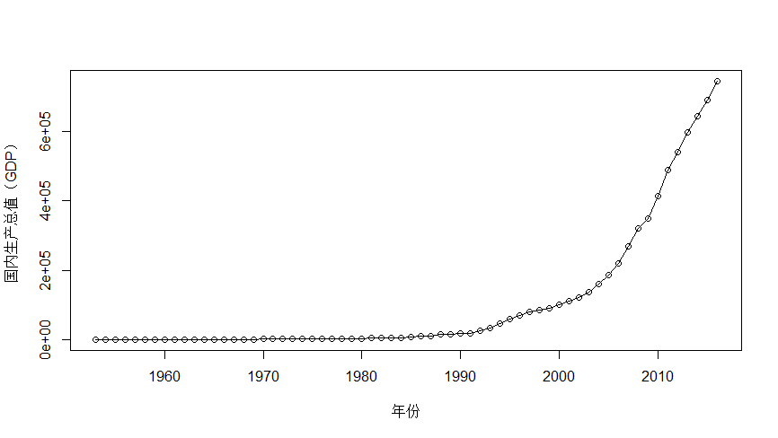
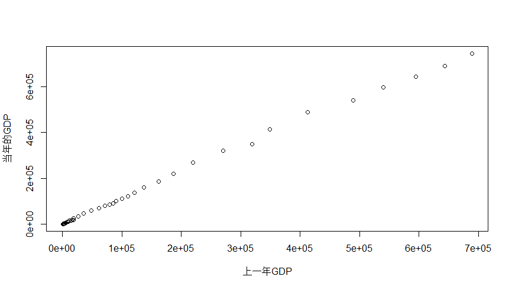

# 时间序列

## 时间序列的定义

定义：时间顺序排列的一组随机变量下，x1,x2,x3....

绘制国内生产总值的图像

```r
>x<-read.table("D:/中北大学/大学学科/大三上/R/DATA/DATA/CHAP1/data1.1.csv",sep=",",header=T)
> GDP<-ts(x$GDP,start = 1953)
>plot(GDP,type="o",xlab="年份",ylab="国内生产总值（GDP）",col=1)
```

时序图：横轴（x）表示时间，纵轴（y）表示观察值



相邻两年的GDP

```r
> y <- GDP[-1]
> x <- GDP[-64]
> plot(x,y,xlab = "上一年GDP",ylab="当年的GDP",col=1)
```



## 时间序列的分类

1、

（1）一元时间序列：每个时间点只观察一个变量

（2）多元时间序列：每个时间点同时观察多个变量（各个变量可能还蕴含各变量的相互依存关系）

2、

（1）连续时间序列：等间隔抽取样本可以转化成离散的时间序列

（2）离散时间序列

3、按时间的统计性质

（1）平稳时间序列

（2）非平稳时间序列

## 时间序列分析方法回顾

1、描述性时间序列分析

特点：操作简单、直观有效

2、统计时间序列分析

数理统计学原理


从时间序列分析方法的发展历史来看：

1、频域的分析方法：也称为频谱分析或谱分析方法

较强的数学基础才能熟练使用

2、时域分析方法：基本思想是事件的发展通常具有一定的惯性，就是序列值之间有一定的相关关系，这种相关关系具有统计规律性

## 时间序列与随机过程

随机过程：一族随机变量放在一起就构成一个随机过程

## 概率分布及其特征

#### 时间序列的有限维分布族

