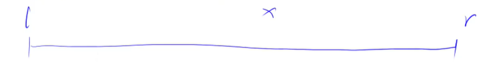
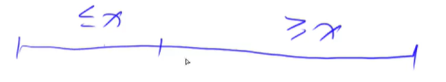
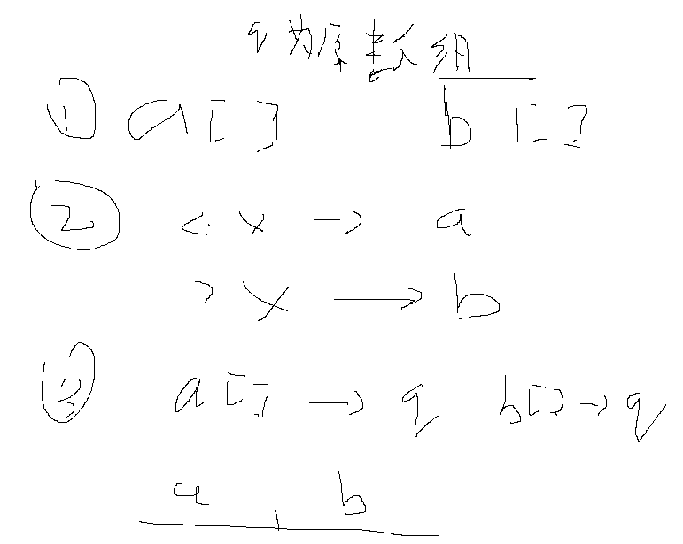
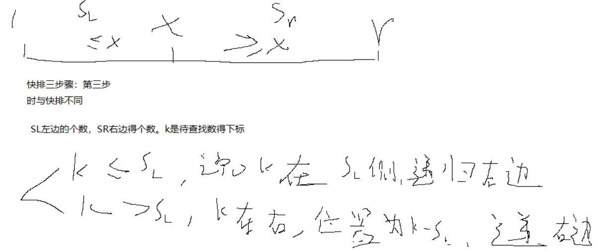

# 算法基础

## 基础算法

### 快速排序

#### 快速排序

分治的思想



1、确定分界点x， f[l]， f[(l + r)/2]， f[r]

2、调整区间（左边所有数Left <= x，右边所有数 Right>= x）



3、递归处理左右两端

**暴力做法**：会浪费空间，时间复杂度不变



**题目描述**

给定你一个长度为n的整数数列。

请你使用快速排序对这个数列按照从小到大进行排序。

并将排好序的数列按顺序输出。

**输入格式**

输入共两行，第一行包含整数 n。

第二行包含 n 个整数（所有整数均在1~109109范围内），表示整个数列。

**输出格式**

输出共一行，包含 n 个整数，表示排好序的数列。

**数据范围**

1≤n≤1000001≤n≤100000

**输入样例：**

```
5
3 1 2 4 5
```

**输出样例：**

```
1 2 3 4 5
```

```c++
#include<iostream>
#include<cstring>

using namespace std;

const int N = 1e6 + 10;
int n;
int q[N]; 
//数据量大建议用scanf读入数据 

//快排模板 
void quick_sort(int q[],int l,int r)
{
	int x = q[(r + l) / 2], i = l - 1, j = r + 1; //x取值是任意的，也可以选择中点。i，j指向真正的边界 
	if(l >= r) return;
	while(i < j)
	{
		do i++; while(q[i] < x);
		do j--; while(q[j] > x);
		if(i < j) swap(q[i],q[j]);
	 } 
	 
	 quick_sort(q,l,j);
	 quick_sort(q,j + 1,r);
}

int main()
{
	scanf("%d",&n);
	for(int i = 0; i < n; i++) scanf("%d", &q[i]);
//	for(int i = 0; i < n; i++) printf("%d ", q[i]);
	quick_sort(q,0,n-1);
	for(int i = 0; i < n; i++) printf("%d ", q[i]);
	return 0;
}
```

#### 第k个数--快速选择算法

**题目描述**

给定一个长度为n的整数数列，以及一个整数k，请用快速选择算法求出数列从小到大排序后的第k个数。

**输入格式**

第一行包含两个整数 n 和 k。

第二行包含 n 个整数（所有整数均在1~109109范围内），表示整数数列。

**输出格式**

输出一个整数，表示数列的第k小数。

**数据范围**

1≤n≤1000001≤n≤100000,
1≤k≤n1≤k≤n

**输入样例：**

```
5 3
2 4 1 5 3
```

**输出样例：**

```
3
```

**解题思路：**



时间复杂度：$n(1+1/2+1/4+1/8+....) <= 2n$   O(n)

```c++
//先快速排序再去查找，时间复杂度为nlog(n)
//局部变量和全局变量重名时优先局部
// #include<iostream>

// using namespace std;

// const int N = 100000;
// int q[N];
// int n;
// int k;

// void quick_sort(int q[], int l, int r)
// {
// 	int x = q[(l + r) / 2], i = l - 1, j = r + 1;
	
// 	if(l >= r) return;
	
// 	while(i < j)
// 	{
// 		do i++; while(q[i] < x);
// 		do j--; while(q[j] > x);
// 		if(i < j) swap(q[i],q[j]);	
// 	}
	
	
// 	quick_sort(q,l,j);
// 	quick_sort(q,j+1,r);
// }

// int main()
// {
// 	cin >> n >> k;
// 	for(int i = 0; i < n; i++) scanf("%d",&q[i]);
// 	quick_sort(q, 0, n-1);
	
// 	cout << q[k - 1];
	
// }


#include<iostream>

using namespace std;

const int N = 100010;
int n;
int k;
int q[N];

int quick_sort(int l,int r,int k)
{
	int x = q[(l + r) / 2], i = l - 1, j = r + 1;
	
	if ( l == r ) return q[l];
	
	while(i < j)
	{
		while(q[ ++i] < x);
		while(q[ -- j] > x);
		
		if(i < j) swap(q[i],q[j]);
	}
	
	int sl = j - l + 1;
	if(k <= sl) return quick_sort(l,j,k);
	
	return quick_sort(j+1,r,k-sl);
}

int main()
{
	cin >> n >> k;
	for(int i = 0; i < n; i++) scanf("%d",&q[i]);
	cout << quick_sort(0 , n - 1 , k);
}
 
```

### 归并排序

#### 归并排序

思想：分治


1. 确定分界点$min=(left+right)/2$
2. 递归排序left和right
3. 归并——合二为一


时间复杂度$log^n$

模板：

```c++
//归并排序
#include<iostream>
#include<cstdio>

using namespace std;

const int N = 1000010;

int n;
int q[N], temp[N];

void merge_sort(int q[], int l, int r)
{
	if (l >= r) return;

	int mid = (l + r) / 2;

	merge_sort(q, l, mid);
	merge_sort(q, mid + 1, r);

	int k = 0, i = l, j = mid + 1;
	while (i <= mid && j <= r)
		if (q[i] < q[j]) temp[k++] = q[i++];
		else temp[k++] = q[j++];
	while (i <= mid) temp[k++] = q[i++];
	while (j <= r) temp[k++] = q[j++];

	for (i = l, j = 0; i <= r; i++, j++) q[i] = temp[j];
}

int main()
{
	scanf_s("%d", &n);
	for (int i = 0; i < n; i++) scanf_s("%d", &q[i]);

	merge_sort(q, 0, n - 1);

	for (int i = 0; i < n; i++) printf("%d ", q[i]);
	return 0;
}
```

#### 逆序对的数量

归并排序：

1. 【L,R】=》【L，mid】，【mid+1，R】
2. 递归排序【L，mid】，【mid+1，R】
3. 归并，将左右两个有序序列合并成一个有序序列

```c++

```

### 二分

有单调性一定可以二分，可以二分的题目不一定非要有单调性

mid=(low+high)/2的改进：如果 low 和 high 比较大的话，两者之和就有可能会溢出。改进的方法是将 mid 的计算方式写成 low+(high-low)/2。性能优化到极致low+((high-low)>>1)计算机处理位运算更快。

##### 整数二分

题目中的二分要求满足一定的性质


右边满足这个性质，左边不满足这个性质

根据这个性质，找到两个边界箭头所指的位置，两个点代表两个不同的模板

①红色点（找边界）


区间都是包含（上面是l+r+1）

②绿色点（找边界）


**两个模板的使用场景：一般先写check函数观察区间改变，如果是l=mid则加1（模板1），否则模板2**

为什么要加1：当l=r-1的时候，mid不加1的话，mid=l，区间还是【l，r】出现死循环；加1，mid=r。


```c++
//区间[l，r]被划分成[l，mid]和[mid+1，r]时使用
int bsearch_2(int l, int r)
{
    while(l<r)
    {
        int mid = l + r >> 1;
        if(check(mid)) r = mid;  //check()判断mid是否满足性质
        else l = mid + 1;
    }
    return l;
}

//区间[l,r]被划分成[l,mid-1]和[mid,r]时使用
int bsearch_2(int l,int r)
{
    while(l < r)
    {
        int mid = l + r + 1 >> 1;
        if(check(mid)) l = mid;
        else r = mid - 1;
    }
    return l;
}
```

#### 数的范围

#### 数的三次方跟

题目要求保留6位小数，判断条件取10得-8，更加保险。lf默认小数点后六位。

### 高精度


#### 高精度加法	

**（1）大整数存储**


数组存储得时候，会把个位存在最前面，因为方便之后的加法进位（进位向前加一个数，最高位进位需要增加一个数，算法在最后一位加数更加容易push_back）。

**（2）运算，模拟人工加法**


 	

t是上一位的进位

```c
#include<iostream>
#include<vector>

using namespace std;

vector<int> add(vector<int>& A, vector<int>& B)
{
	vector<int> C;
	int t = 0;
	for (int i = 0; i < A.size() || i < B.size(); i++)
	{
		if (i < A.size()) t += A[i];
		if (i < B.size()) t += B[i];
		C.push_back(t % 10);
		t /= 10;
	}

	if (t) C.push_back(1);
	return C;
}

int main()
{
	string a, b; 
	vector<int> A, B;

	cin >> a >> b; // a = "123456"
	for (int i = a.size() - 1; i >= 0; i--) A.push_back(a[i] - '0');//A=[6,5,4,3,2,1]
	for (int i = b.size() - 1; i >= 0; i--) B.push_back(b[i] - '0');

	auto C = add(A, B);

	for (int i = C.size() - 1; i >= 0; i--) printf("%d", C[i]);

	return 0;
}
```

#### 高精度减法

**（1）存储是一致的**

**（2）计算**


```c++
#include<iostream>
#include<vector>

using namespace std;

//判断A>=B
bool cmp(vector<int>& A, vector<int>& B)
{
	if (A.size() != B.size()) return A.size() > B.size();
	for (int i = A.size(); i >= 0; i--)
	{
		if (A[i] != B[i]) return A[i] > B[i];
	}
	return true;
}

vector<int> sub(vector<int>& A, vector<int>& B)
{
	vector<int> C;
	for (int i = 0, t = 0; i < A.size(); i++)
	{
		t = A[i] - t;
		if (i < B.size()) t -= B[i];
		//这里考虑t的两种情况
		C.push_back((t + 10) % 10);
        //借位
		//两数相减小于0需要借一位，否则就是0
		if (t < 0) t = 1;
		else t = 0;
	}
	//123-120=003去掉结果的0
	while (C.size() > 1 && C.back() == 0) C.pop_back();

	return C;
}

int main()
{
	string a, b;
	vector<int> A, B;

	cin >> a >> b; // a = "123456"
	for (int i = a.size() - 1; i >= 0; i--) A.push_back(a[i] - '0');//A=[6,5,4,3,2,1]
	for (int i = b.size() - 1; i >= 0; i--) B.push_back(b[i] - '0');

	if (cmp(A, B))
	{
		auto C = sub(A, B);

		for (int i = C.size() - 1; i >= 0; i--) printf("%d", C[i]);
	}
	else
	{
		auto C = sub(B, A);

		printf("-");
		for (int i = C.size() - 1; i >= 0; i--) printf("%d", C[i]);
	}

	

	return 0;
}
```

#### 高精度乘法


```c++
#include<iostream>
#include<vector>

using namespace std;

vector<int> muti(vector<int> &A, int b) 
{
	vector<int> C;
	int t = 0;

	for (int i = 0; i < A.size() || t; i++)
	{
		if (i < A.size()) t += A[i] * b;
		C.push_back(t % 10);
		t /= 10;
	}
	// 去掉前导0
	while (C.size() > 1 && C.back() == 0) C.pop_back();

	return C;
}

int main()
{
	vector<int> A;
	string a;
	int b;

	cin >> a >> b;

	for (int i = a.size() - 1; i >= 0; i--) A.push_back(a[i] - '0');

	auto C = muti(A, b);

	for (int i = C.size() - 1; i >= 0; i--) printf_s("%d", C[i]);

	return 0;
}
```

#### 高精度除法


```c++

```

### 前缀和差分

#### 前缀和

#### 子矩阵的和

子矩阵怎么计算


s[i，j]怎么计算


#### 差分


## 数据结构

### 单链表

笔试不会用：

