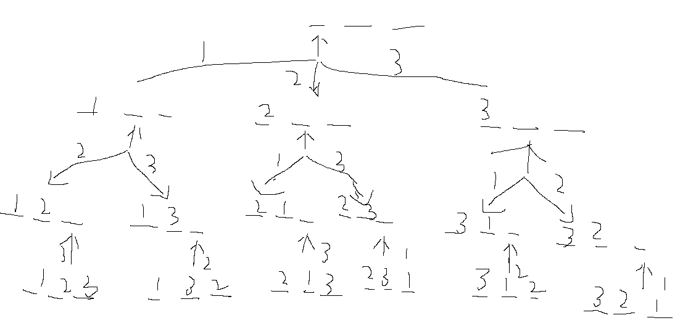

# 递归实现排列型枚举

**题目描述**：

把 1~n 这 n 个整数排成一行后随机打乱顺序，输出所有可能的次序。

**输入格式**

一个整数n。

**输出格式**

按照从小到大的顺序输出所有方案，每行1个。

首先，同一行相邻两个数用一个空格隔开。

其次，对于两个不同的行，对应下标的数一一比较，字典序较小的排在前面。

**数据范围**

1≤n≤9

**输入样例：**

```
3
```

**输出样例：**

```
1 2 3
1 3 2
2 1 3
2 3 1
3 1 2
3 2 1
```

**解题思路：**

字典序：

A{a1,a2,a3,a4,a5...}

B{b1,b2,b3,b4,b5...}

若ai大于bi，则A>B

若ai小于bi，则A<B

若ai等于bi，则A=B

若ai有值，bi不存在，则A>B

字典序最小可以是正常输出的结果，1、2、3枚举最后结果就是最小值

递归方式：

顺序1：一次枚举每个数放那个位置 

顺序2：一次枚举每个位置放那个数

顺序2递归搜索树 ：



结果最后一定是字典序排序的

